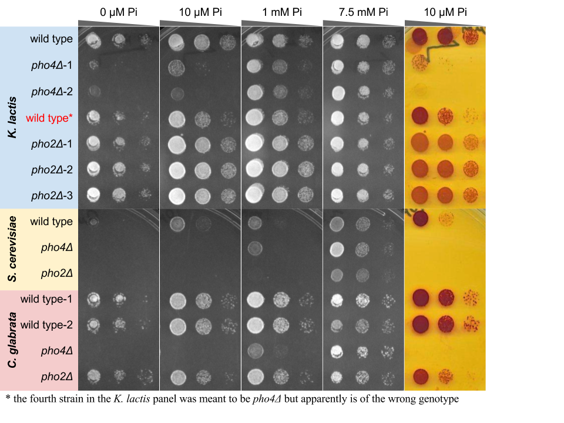

## Goal

- Test whether Pho2 is required for PHO5 induction and survival in low Pi in _K. lactis_  The reason this question is important is because I only have the PHO5 induction phenotype for  PHO4 orthologs from different species in the _S. cerevisiae_ background. I wanted to know if the PHO4 orthologs that show Pho2 dependence in _S. cerevisiae_ also depend on Pho2 in the native context.

## Notes

### [12/15] Ex005.3 prepare fragments for Gibson

*   Used ALine beads to purify the Klac4 flanking fragments, worked well, got ~60 ng/uL
*   PCR for the hph fragment using pYM24 as template (2 ng/μl from Elmar) resulted in diffuse products &lt 1 kb (expect 1.6 kb). Repeated the PCR with new miniprep, using either 1ng or 100 pg as starting amount.
*   Miniprep for pYM24 and submitted for sequencing (SP6 promoter, T7 promoter)
*   Performed restriction endonuclease digestion
    1.  Double digestion with BamHI and EcoRI
    1.  Sequential digestion with HindIII-HF followed by BglII
        *   Because there is no buffer in which both enzymes work > 50% efficiency, a sequential digestion is recommended by NEB, wher
*   Plan for tomorrow
    1.  Continue readying the Gibson fragments
    1.  Attempt at Gibson, also try Sewing PCR, perhaps even try TRAFO

### [12/16] Ex005.4 Gibson assembly

*   Both RE digestion and PCR for hph worked yesterday.
*   Gel purified the vector backbones and column purified the sequentially digested vector and PCR products
*   Tested Gibson assembly for both 1-step and step 1 of the 2-step procedure
*   Sanger sequencing of pYM24 confirmed the hp sequence

### [12/20] Ex005.4 Gibson assembly

*   Both 1-step and 2-step (step 1) Gibson appears to have worked (more colonies than control). 
*   Surprisingly, 1-step Gibson with 4 pieces worked quite efficiently -- it produced ~¼ of the transformants as the 2-piece Gibson did. The nice thing is that, it has relatively low background -- the plate containing Gibson with only the vector derived backbone and PCR generated hph fragment yielded few colonies, in contrast to the control for the 2-step Gibson. 
    *   I think the difference is probably due to vector quality.. For the 1-step procedure, I had to use sequential digestion with HindIII-HF and BglII because there is no buffer in which both enzymes have > 50% maximum efficiency. For the 2-step method, I did double digestion in the same buffer with BamHI and EcoRI. I had to use gel purification to selectively extract the correct size band. This supposedly should clean up the background. But for some reason, I got higher background than the one-step, 4-pieces assembly.
*   Sanger sequencing result confirmed that all three pHB25 colonies sequenced contained the correct plasmid. By contrast, only one of the 6 pHB24 colonies sequenced contained the correct sequence.  
*   PCR using SP6 and T7pro (p221/223) worked well with pHB24_2 and pHB25_1-3. However, p373/374, which supposedly should amplify the KO construct, only produced a short product of ~800 bp. 
*   Designed new oligos for KlacPho2 KO.

### [12/23] Ex005 Klac4 KO

*K. lactis* strain is ready. PCR products are also ready (may do another pcr and combine). TRAFO can be done on Sunday, provided that I can start the culture tomorrow evening. I also need to order some primers for checking colonies, should the TRAFO work.

### [1/12] Ex005.5 KO Klac4 / Klac2

*   My first attempt to KO Klac4 failed -- I used the standard yeast high efficiency TRAFO protocol, with ~500 ng of linear DNA. I got two colonies on the plus plate and none on the negative control. However, both colonies were false positives -- since they can grow on the drug plate, most likely they've incorporated the linear DNA, but taken them into the wrong genomic location
*   Alex in Desai lab reminded me that when using drug selection, I should first plate the cells on YPD and then replica plate onto drug media
*   Before leaving for Princeton, I also did PCR for KlPho2 KO flanking sequences. They worked. Today I did Gibson assembly, but will leave TRAFO to tomorrow?

### [1/13] Ex005.6 Gibson assembly for Klac2 KO, compare Mach 1 with DH5alpha

*   Gibson assembly TRAFO from yesterday didn't grow well. I used the Mach1 strain that Chris Shoemaker recommended, because it is supposed to grow faster than DH5alpha. However, after o/n growth, only tiny colonies are visible. And there are very few colonies on No 2 plate, which is the 1-step assembly product.

*Compare Mach 1 and DH5alpha*

*   Experiment and results
    *   To determine if it is the Mach 1 strain or my Gibson assembly that is to blame, I did a control experiment and got the following results
Table. Compare TRAFO efficiency of DH5alpha vs Mach1

<table>
  <tr>
   <td>
<strong>No</strong>
   </td>
   <td><strong>Gibson Mix</strong>
   </td>
   <td><strong>Description</strong>
   </td>
   <td><strong>Host</strong>
   </td>
   <td><strong>Colonies (20170114)</strong>
   </td>
  </tr>
  <tr>
   <td>1
   </td>
   <td>G0112a
   </td>
   <td>2-step assembly for Klac2
   </td>
   <td>DH5alpha
   </td>
   <td>++++
   </td>
  </tr>
  <tr>
   <td>2
   </td>
   <td>G0112b
   </td>
   <td>1-step assembly for Klac2
   </td>
   <td>DH5alpha
   </td>
   <td>27
   </td>
  </tr>
  <tr>
   <td>3
   </td>
   <td>G0112c
   </td>
   <td>negative control for 0112a
   </td>
   <td>DH5alpha
   </td>
   <td>+++
   </td>
  </tr>
  <tr>
   <td>4
   </td>
   <td>G0112d
   </td>
   <td>negative control for 0112b
   </td>
   <td>DH5alpha
   </td>
   <td>8
   </td>
  </tr>
  <tr>
   <td>5
   </td>
   <td>G1216a
   </td>
   <td>2-step assembly for Klac4
   </td>
   <td>DH5alpha
   </td>
   <td>++++
   </td>
  </tr>
  <tr>
   <td>6
   </td>
   <td>G0112b
   </td>
   <td>1-step assembly for Klac2
   </td>
   <td>Mach1
   </td>
   <td>12
   </td>
  </tr>
  <tr>
   <td>7
   </td>
   <td>G1216b
   </td>
   <td>1-step assembly for Klac4
   </td>
   <td>Mach1
   </td>
   <td>++
   </td>
  </tr>
  <tr>
   <td>8
   </td>
   <td>G1216c
   </td>
   <td>negative control for 1216a
   </td>
   <td>Mach1
   </td>
   <td>+
   </td>
  </tr>
</table>

	"+" > 50; "++" > 100; "+++" > 500; "++++" > 1000 

*   Conclusion
    *   This time, both 1-step and 2-step assembly have relatively high false positive rates, as judged by the negative control plate colony count
    *   1-step assembly has fairly low transformation efficiency. It's likely the problem of the Gibson assembly having low amount of assembled products
    *   DH5alpha has higher transformation efficiency as compared with Mach 1, but not by a lot: comparing 2 and 6, DH5alpha has twice as many colonies. But I also didn't use exactly the same volume of Gibson mix to transform the two. I used 5 μl of the mix for 2, and only  have ~3 μl left for 6.
    *   Mach 1 does seem to produce more "star" colonies. 
*   Plan
    *   Pick colonies for sequencing: 4 from plate 1, 8 from plate 2 and 8 from plate 6

### [1/17] Ex005.7 Klac4,2 KO

*   Performed PCR to yield > 1.5 μg DNA
*   Transformed 5 OD.mL Klactis (NRRLY1140) with the DNA constructs
*   Tested 30', 40', 50' of heat shock
*   Plated onto YPD plates that were pre-treated with 120 μl of 50 mM Pi solution (to avoid the desired mutants having a disadvantage during growth)
*   Plan to replica the plate tomorrow morning.

### [1/23] Ex005.7 Klac4,2 KO check

*   Plate A,B,C,E had a large number (>200) colonies, while D and F (negative control) had none. This shows hygromycin selection produces very low (=0 in this case) background
*   PCR screened 8 colonies each for the four plates. 
    *   Home phusion mix is not efficient, resulting in > 50% PCR failures (neither positive nor negative primer pairs yield any products)
    *   Switched to Phusion Flash, worked very nicely for plate A/B
*   Screening result
    *   Klac4 KO: 1/16 screened is positive. Screen another 12
    *   Klac2 KO: so far 8/16 are surely negatives. The remaining 8 are uncertain. Do one more PCR to confirm. 

### [1/25] Ex005.7 Klac4,2 KO check

*   Continued screening
    *   All newly picked colonies were false positives!
    *   Redid PCR on plate C/E (Klac2Δ), and C3 showed up as positive
    *   So far one positive for 4 and 2 each
    *   Success rate is rather low

*Did*

*   Per Dennis' suggestion, I reprinted plates A and C onto 10 uM or 100 uM Pi YPD plates, plan to do plate assay tomorrow.
*   Also saved A8 and C3 (the two positives identified so far) on a fresh YPD+Hyg plate

### [1/26] Ex005.7 Klac4,2 KO plate assay check

*   Plate assay worked on this species. All but a handful of colonies (< 5) on plate A replica, either at 10 uM or 100 uM Pi concentration, turned dark red, suggesting that they've activated their PHO pathway. Those that didn't respond indeed include A7, which is the only positive clone I identified by PCR assay.
*   For plate C, which is Klac2-, most of the colonies also turned dark red. But this time, the few (~10) colonies that were different from the rest showed *reduced* instead of *no* pigmentation. This suggests that Pho2 is partially required for inducing the secreted phosphatase.
*   The next step would be to isolate the positive colonies, re-validate them by PCR, and perform a proper plate assay with spotted cells, as well as performing survival assays. Based on the plate assay I did today, it is likely that *K. lactis pho2Δ* may not completely lost viability on low Pi medium, because *C. glabrata* also showed partial dependence on its Pho2 for inducing Pmu2, and yet that partial dependence in gene induction doesn't seem to affect the organism's survival.
*   If the results should indeed be as I suspected above, I will need to change the interpretation of the results. 
    1.  Because the transgenic plate assay (Figure 2) doesn't necessarily reflect the endogenous state of Pho2-dependence for non-*cerevisiae* Pho4 orthologs, I cannot draw the conclusion that Pho2 dependence is the ancestral state among the Hemiascomycetes. Rather, I would need to profile more outgroup species of *S. cerevisiae* and *C. glabrata* in their endogenous species to reveal the evolutionary history of this trait. 
    1.  Furthermore, without doing the mutant cycle analysis in *K. lactis*, it is not possible to know if the target expansion is correlated with Pho2 dependence, and whether it is derived or ancestral.
    1.  One potential concern in the above thinking is that, *K. lactis* Pho4 didn't function well in the *S. cerevisiae* background. As a result, the conclusion that it is Pho2 dependent is less certain than, say, *L. kluyveri*.
*   What still stands is the comparison between *S. cerevisiae* and *C. glabrata* in their native background. The reduction in Pho2 dependence and expansion of Pho4 targets are both on solid ground.
*   The bigger question stands as well: how does the overall stress response network change in a commensal species, in terms of its upstream signaling, its gene regulation and its downstream effectors (and their physiological effects).
*   What I cannot say for sure is that reduction in Pho2-dependence only evolved in the *glabrata* group and the *C. albicans* lineage. It is likely that Pho2 didn't always play as a central role as it does in *S. cerevisiae*. If that's the case, then it just flips our original question around, i.e. instead of asking what is special about *C. glabrata* and its relatives, now the question becomes what is special about *S. cerevisiae* and the other *sensu stricto* species. Why do their genomes evolved *enhanced* dependence on Pho2 -- and this even goes hand-in-hand with another puzzling observation, namely the acquisition of Spl2 to institute a positive feedback. Interestingly, the existence of Spl2 also enhanced the organism's dependence on Pho2, because while most of the PHO genes are not induced in the absence of Pho2, Spl2 is among the few that still gets turned on. Normally, its function is to pull back the low-affinity Pi transporters while the high affinity transporters are being made and installed. Now without the latter, Spl2 essentially exacerbated the Pi starvation. 

### [2/2] Ex005.7 Klac4,2 KO made

*   PCR verified all four *pho4Δ* and eight *pho2Δ*
*   Saved the first two isolates of each in database
*   Reorganized my strain database to use a uniform ID (uID) for all yeast strains

### [2/5] Ex005.8 Klac Pho2 dependence

_Notes_

*   I grew up HY149 (*K. lactis* wild-type, NRRLY1140), 3 isolates each from confirmed *pho4Δ* and *pho2Δ* that I just made
*   As control, I also streaked out and grew *S. cerevisiae* wild-type (EY0057), *pho4Δ* (EY1710), *pho2Δ* (EY0252), as well as *C. glabrata* wild-type (EY1706 and CG1), *pho4Δ* (CG3) and *pho2Δ* (CG5)
*   On 3 fev 2017, I inoculated each strain into fresh 10 mM Pi SC media, let grow o/n
*   On 4 fev 2017 afternoon, I measured the OD of the cells, spin to remove media and resuspend in dI water. Afterwards, I diluted the cell suspension to the desired OD (0.5 for *S. cerevisiae* and *K. lactis*, 0.05 for *C. glabrata*, taking into account the faster doubling time of the latter species - averaging 60' vs 90' for the other two)
*   I made 1:1, 1:10 and 1:100 dilutions from the already normalized cell suspension, and transferred them using a 48 pin tool onto plates containing different amount of Pi (0, 10 μM, 1 mM, 7.5 mM - note: I ran out of 100 μm and 10 mM plates)
*   Today I imaged the plates, except for 0 μM Pi because the results are almost identical to that of the 10 μM one.

*Results*

*   *K. lactis* appears to not require Pho2 for its survival under low phosphate conditions. In addition, Pho2 is only partially required for inducing its secreted acid phosphatase (rightmost panel)
*   Somewhat surprisingly, *pho4Δ* strain in *K. lactis* is able to grow to some extent even on no Pi media, which neither of the other two species could do. This seems to suggest that there may be a Pho4-independent mechanism responsible for scavenging phosphate from the environment or somehow coping with the absence of an essential nutrient. 
*   Interpretation
    *   Note that KlacPho4 [only](https://drive.google.com/open?id=10VNQzQxJ0jS7GvzpwXXMvWKer7s8Xp42M5-zrDmyt44)1 *[weakly rescues](https://drive.google.com/open?id=0BzL_Etr6O7DMMVlRTmJWQ1FTOWc)2* *pho4Δ* in *S. cerevisiae*. Nevertheless, the result does seem to suggest that KlacPho4 is Pho2-dependent in that genetic background.
    *   Although KlacPho4 is Pho2-dependent in *S. cerevisiae*, it doesn't mean that the same is true in the endogenous species. Either promoter evolution or changes in the chromatin openness could alter the level of Pho2 requirement.
    *   There also seem to be Pho4-independent mechanism for *K. lactis* to cope with severe phosphate starvation. 
    *   Finally, the strong dependence on Pho2 in *S. cerevisiae* is likely unique in its own regard, due to the intricate relationship between Pho4, Pho2 and Spl2, the last of which can be induced by Pho4 w/o Pho2 and functions to remove low-affinity Pi transporter from the plasma membrane. This causes *pho2Δ* cells missing not only the low Pi induced high-affinity phosphate transporter, but also the remaining low affinity ones, hence an exacerbated effect. Because *SPL2* is only present in the *sensu stricto* species, the defect due to *pho2Δ* is likely less severe in species outside this group, even if they lack the CgPho4's ability to bind and induce gene expression independent of Pho2.

*Looking ahead*

*   The result of this experiment emphasizes the urgent need to investigate the endogenous Pho2-dependence in species other than the four I've surveyed so far. An obvious choice for the next experiment would be *Lachancea kluyveri*, because it shows clear Pho2-dependence in *S. cerevisiae* background.
*   A separate question is, given that *K. lactis* doesn't require Pho2 for inducing PHO genes, does its Pho4 also induce more genes as compared to ScPho4 in *S. cerevisiae*?
