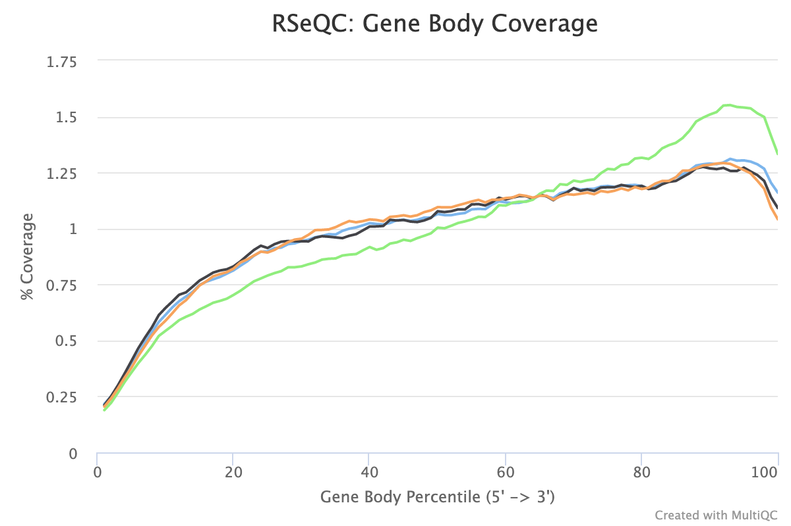
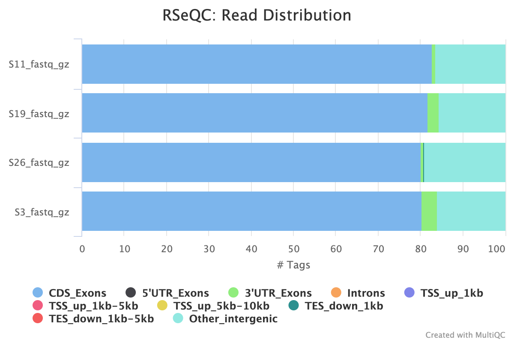
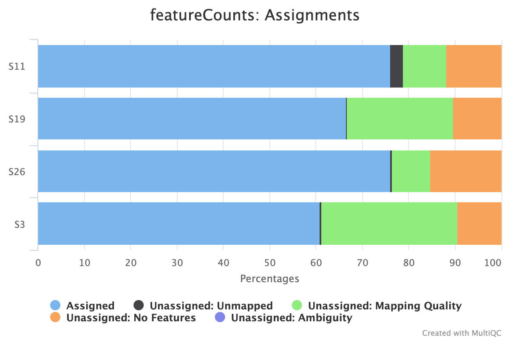
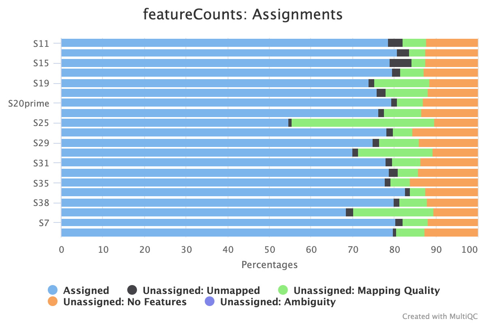

# Goal

Use [Galaxy](usegalaxy.org) to perform quality control for the raw fastq reads, the mapped reads and gene counts. This is inspired by the [Tutorial](https://training.galaxyproject.org/training-material/topics/transcriptomics/tutorials/ref-based/) I used for the Bioinformatics for Beginners course. The goal is to check the quality of the reads and mapping, and also use this opportunity to update the genome reference for mapping to the latest long-read based one. Check to see if the read counts have any significant changes.

# Results

## FastQC on raw reads

1. percent duplicates are in ~60-75%. one library is as high as 78%
2. sequence quality (75bp) seems fine.

Because there are nearly no over-represented sequences and adapter contamination, and the sequence quality is high throughout the reads, I don't think trimming will help with mapping.

Next, I picked four datasets to test several mapping tools. The four datasets are: S3, 11, 19, 26

## Mapping test

### RNA STAR

Parameters:

- Length of SA pre-indexing length: 14
- Length of genome sequence around annotated junctions: 74
- Use 2-pass: no
- Per gene/transcript output: Per gene read counts

| Sample Name  | % Aligned | M Aligned |
| :----------- | :-------- | :-------- |
| S11_fastq_gz | 95.2%     | 7.9       |
| S19_fastq_gz | 96.0%     | 5.5       |
| S26_fastq_gz | 98.0%     | 16.5      |
| S3_fastq_gz  | 94.4%     | 5.0       |

### HiSAT2

Parameters:

- Specify strand information: Reverse

| Sample Name       | % Aligned |
| :---------------- | :-------- |
| S11_fastq_gz      | 96.4%     |
| S12_fastq_gz      | 96.9%     |
| S15_fastq_gz      | 94.6%     |
| S16_fastq_gz      | 98.1%     |
| S19_fastq_gz      | 98.4%     |
| S20_fastq_gz      | 97.7%     |
| S20prime_fastq_gz | 98.5%     |
| S23_fastq_gz      | 98.4%     |
| S25_fastq_gz      | 98.9%     |
| S26_fastq_gz      | 98.4%     |
| S29_fastq_gz      | 98.3%     |
| S31_fastq_gz      | 98.4%     |
| S32_fastq_gz      | 97.8%     |
| S35_fastq_gz      | 98.7%     |
| S37_fastq_gz      | 98.8%     |
| S38_fastq_gz      | 98.6%     |
| S3_fastq_gz       | 98.4%     |
| S4_fastq_gz       | 97.9%     |
| S7_fastq_gz       | 98.2%     |
| S8_fastq_gz       | 99.0%     |

- One sample, **S19**, seems to be an outlier!

## Mapping quality

These tests are based on the STAR mapped reads. Given the similarity in % reads mapped, I believe the results based on other aligners will be the same.

### Gene body coverage

- I think the kit has a poly-A selection step, which would explain the 3' biased coverage, as degradation happening on the 5' end will still be selected, but 3' end degraded transcripts would have been left out.
- **S26** stands out -- probably more degradation than others.

### Read distribution over features

- ~20% of the reads map to "other intergenic" regions. Note that when viewing in IGV, it is clear the genic regions in the yeast genome annotation contains only the CDS. 5'UTR and 3'UTR were not annotated. So the "Other_intergenic" should contain those.

## Read counting

### RNA STAR

### HISAT2

### Kallisto

Pseudo-alignment based, parameters

- average fragment length (--fragment-length): 200
- sd of fragment length (--sd): 20
- perform sequence based length correction (--bias): yes
- library strandedness: unstranded

fraction of pseudo-aligned ~75%

downloaded the hdf5 binary result files

### Salmon

Similar to `kallisto`. Parameters:

- Kmer length: 31
- --libtype: reverse strand (SR)
- --type: quasi
- --validate-mapping: yes
- perform GC bias correction (--gc): yes
- 
