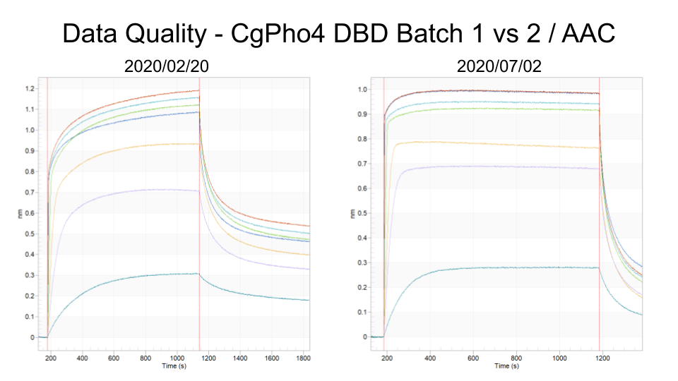
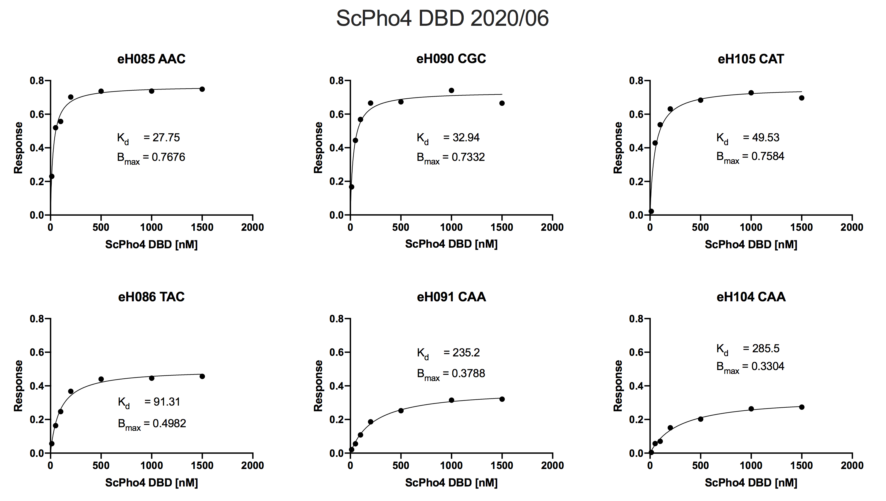
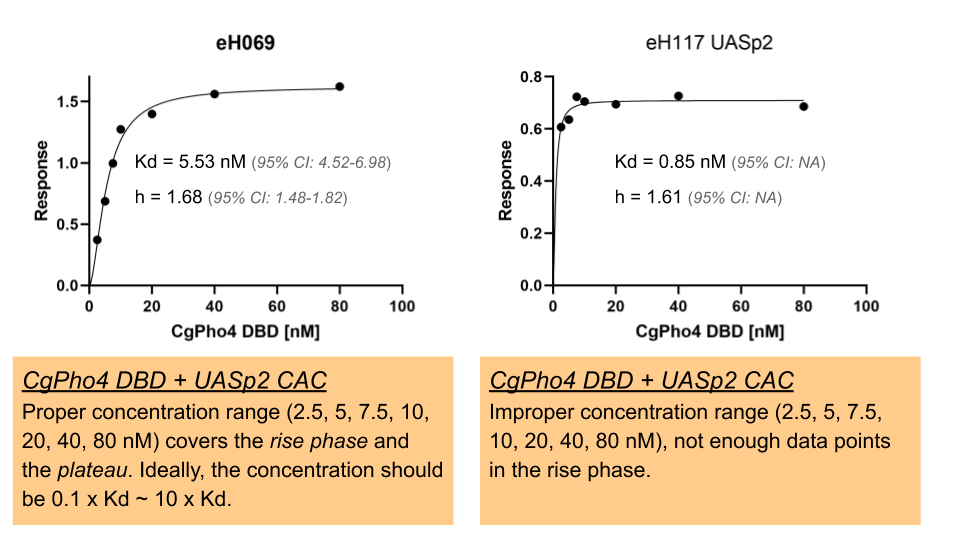
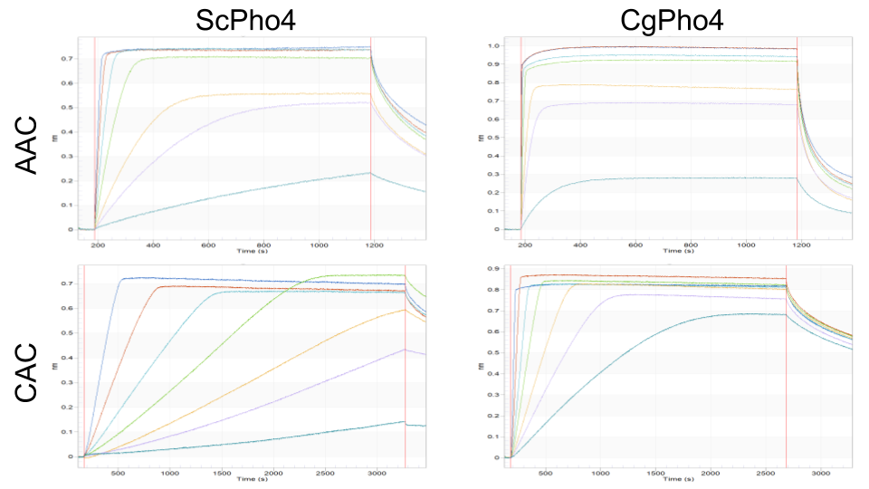

```{r setup, echo=FALSE}
suppressPackageStartupMessages(library(tidyverse))
```

## 2020-08-30 update
Included new batch of data. Analyses are updated as appropriate below.

### Goal

Analyze BLI data to check the consistency between batches of experiments and compare the binding affinities between ScPho4 vs CgPho4 DBDs against the consensus motif and the nine 1-bp-off variants.

### Data

| Batch | Exp. Date | Analyte | Purification | Concentration | Notes |
|-------|-----------|---------|--------|-------|
| 1 | 02/2020 | CgPho4 | rH015 | 1.5 mg/mL | has issues with NSB |
| 2 | 06/2020 | ScPho4 | rH016 | 2.0 mg/mL | used immediately after purification |
| 3 | 06/2020 | ScPho4 | rH016 | 2.0 mg/mL | used 1wk after purification |
| 4 | 07/2020 | CgPho4 | rH017 | 2.1 mg/mL | used immediately after purification |
| 5 | 07/2020 | CgPho4 | rH018 | 0.6 mg/mL | used immediately after purification |
| 6 | 08/2020 | CgPho4 | rH018a | 1.8 mg/mL | used 1wk after purification |

### Load data
```{r}
dat <- read_tsv("../data/BLI/2020-Feb-Aug-Kd-estimates_3.tsv")
dat <- dat %>% 
  mutate(Half_site = factor(str_sub(Ligand,7,9), 
                            levels = c("CAC","AAC","TAC","GAC","CTC","CCC","CGC","CAA","CAT","CAG")))
```

### Data quality - $B_{max}$ values
```{r Bmax, fig.width=10, fig.height=5}
dat %>% filter(!is.na(Bmax)) %>% 
  ggplot(aes(x = Exp, y = Bmax, fill = Batch)) + 
  geom_bar(stat = "identity") + 
  geom_errorbar(aes(ymin = Bmax_95ci_low, ymax = Bmax_95ci_high, width = 0.5)) +
  facet_wrap(~Protein, scales = "free_x") +
  theme(axis.text.x = element_text(angle = 60, hjust = 1)) + 
  labs(title = "Bmax estimates, error bar represents 95% confidence interval", x = "Experiment")
```
_Discussion_

- CgPho4 DBD
    1. eH069 had a loading value of 0.3 (how much DNA is loaded on to the sensor, determine Bmax).
    1. eH069-082 also had obvious second phase binding, which could lead to overestimation of Bmax.
        
    1. Experiments using the rH018 and rH018a batches used 1/2 the DNA loading concentration, and thus are expected to have lower Bmax
- ScPho4 DBD
    1. eH083-117 are more similar to each other. Kyle started to implement a strategy that achieves an average loading signal of 0.2.
    1. Within eH083-117, the experiments with apparently low Bmax also tend to be those with high Kd (low affinity)

```{r bmax_kd, echo=FALSE, fig.width=8, fig.height=4}
dat %>% 
  filter(Include, !grepl("rH018", Batch)) %>% 
  ggplot(aes(x = Kd, y = Bmax, col = Batch)) + geom_point(size = 1.5) +
  geom_smooth(formula = y~x, method = "lm") +
  facet_wrap(~Protein, scales = "free_y") +
  labs(title = "Unexpected negative correlation between Bmax and Kd estimates for ScPho4 DBD")
ggsave("imgs/20200830-low-Bmax-for-low-affinity-seq.png", width = 5, height = 3)
```

- The negative correlation between Kd and Bmax estimates is only apparent with rH015 for CgPho4 DBD, where second phase binding is prevalent.
- For ScPho4 DBD measurements, there is only one batch of protein (rH016, where rH016a is the same batch, but used a week after the purification), and the negative relationship is strongly present. This is obvious when we look at the curve-fitting plots.
    

- Constraining Bmax during fitting will result in poor fits of the low affinity sequences. Can there be a biological reason (non-technical) that causes lower Bmax for low affinity sequences?

### Data Quality - Reproducibility

Here we would like to assess the reproducibility of the experiments by plotting Kd estimates for the same protein-ligand pair from different batches.

$k_d$ estimates across repeats, with semi-transparent background highlighting experiments with low $B_{max}$ estimates
```{r reproducibility_Kd, echo=FALSE, fig.width=10, fig.height=5}
# plot Kd ± 95%CI for each experiment, fill-color by protein source
dat %>%
  filter(Include, grepl("UASp2", Ligand), Exp != "eH106") %>% 
  # remove UASp1 and a falty experiment 071, also remove eH106, which had large variance in Kd estimate
  mutate(Ligand = str_sub(Ligand, 6,-1)) %>% 
  ggplot(aes(x = Half_site, y = Kd, fill = Batch)) + 
  geom_col(position = position_dodge2()) +
  geom_errorbar(aes(ymin = Kd_95ci_low, ymax = Kd_95ci_high), position = position_dodge2()) +
  labs(title = "Kd estimates, error bars represent 95% confidence intervals", 
       subtitle = "(UASp1 and eH071 excluded)", y = "Kd [nM]") +
  #scale_alpha_manual(values = c(0.4,1)) +
  #scale_fill_manual(values = c("blue2","green3")) +
  scale_y_log10() +
  facet_wrap(~Protein, scales = "fixed") +
  theme_bw()
ggsave("imgs/20200901-Kd-estimates-with-Bmax-issue-labeled.png", width = 10, height = 5)
```
_Discussion_

1. CgPho4 DBD against UASp2 CAC (consensus) showed an order of magnitude lower $K_d$ in the latest set of experiments (with rH018) compared to previous experiments. Now the $K_d$ estimates are in the sub-nanomolar range. Need to remeasure ScPho4 with the same titration serie (towards lower concentrations of the protein)
1. $K_d$ estimates across repeats show more variability for certain protein+sequence combos, such as 
    - CgPho4+CAC/CTC/CCC/CAA
    - ScPho4+CTC/CCC/CGC/CAG
1. Some potential sequences with different $K_d$s:
    - CAC, CTC, CCC, CAT

Demonstrate inapprpriate titration series:



### Compare ScPho4 and CgPho4 DBD binding affinities
```{r compare_Kd, echo=FALSE, fig.width=10, fig.height=5}
# plot Kd ± 95%CI for each experiment, fill-color by protein source
dat %>%
  filter(Include, Batch %in% c("rH016", "rH016a", "rH017", "rH018"), grepl("UASp2", Ligand), Exp != "eH106") %>% 
  # remove UASp1 and a falty experiment 071, also remove eH106, which had large variance in Kd estimate
  mutate(Ligand = str_sub(Ligand, 6,-1)) %>% 
  ggplot(aes(x = Half_site, y = Kd, fill = Protein)) + 
  geom_col(position = position_dodge2()) +
  geom_errorbar(aes(ymin = Kd_95ci_low, ymax = Kd_95ci_high), position = position_dodge2()) +
  scale_fill_manual(values = c("blue2","green3")) +
  labs(title = "Kd estimates, error bars represent 95% confidence intervals from non-linear fitting", y = "Kd [nM]") +
  #scale_alpha_manual(values = c(0.4,1)) +
  #scale_fill_manual(values = c("blue2","green3")) +
  scale_y_log10() +
  theme_minimal()
ggsave("imgs/20200915-Kd-estimates-comparison.png", width = 8, height = 4.5)
```
### Summary & Next steps

1. Feb 2020 batch of CgPho4 data may lead to higher $B_{max}$ estimates. Its influence on $K_d$ is less clear.
1. The second batch of ScPho4 experiments used protein that had sit at 4C for ~7d. There is some sign of NSB but not significant.
1. However, in both batches of ScPho4 experiments, there is a negative correlation between estimates of $K_d$ and $B_{max}$. This trend is not present with the latter batch of CgPho4 (rH17) but is present with the earlier one where second phase binding is apparent.
    - Based on my understanding of the BLI technique, $B_{max}$ should only depend on the density of the oligos loaded on the SA sensor for any given protein. No apparent explanation exists for such a negative correlation. Note that **underestimation of $B_{max}$ results in overestimation of $K_d$**. Therefore we should consider repeating the following experiments:
    `r dat %>% filter(!is.na(Kd), Bmax < 0.6) %>% select(Exp, Protein, Ligand, Bmax, Kd)`
1. In the following experiments the titration series need to be shifted to lower concentration. How that will affect $K_d$ is unclear.

    | Exp   | Protein | Ligand | $K_d$ |
    | ----- | ------- | ------ | ------|
    | eH082 | CgPho4  | CAT    | 15.32 |
    | eH083 | ScPho4  | CAC    | 3.32  |
    | eH098 | ScPho4  | UASp1  | 3.244 |
    | eH106 | CgPho4  | CAC    | 0.8826|
    | eH110 | CgPho4  | CAT    | 49.53 |
    | eH113 | CgPho4  | CTC    | 8.358 |
    | eH116 | CgPho4  | UASp1  | 2.923 |
    | eH117 | CgPho4  | CAC    | 0.8548|
    **update 2020-08-30**
    I've now done the new experiments and the results seem to hold.
    
1. An interesting observation is that even when ScPho4 DBD and CgPho4 DBD showed similar $K_d$, the former seems to have a slower kinetics, as shown below:
    

1. At this point, we need to accept that there is not a large difference in $K_d$ between ScPho4 and CgPho4 DBD. After we fix the technical issues above, we will know if there is any measurable difference at all. What is less clear is, what level of difference in $K_d$ could explain the observed binding events differences _in vivo_ between the two orthologous TFs.
1. Going forward, we have the option of testing full length protein _in vitro_, or to move _in vivo_ to determine if the difference in binding events is attributable to regions outside the DBD (similar to the latest Barkai paper)