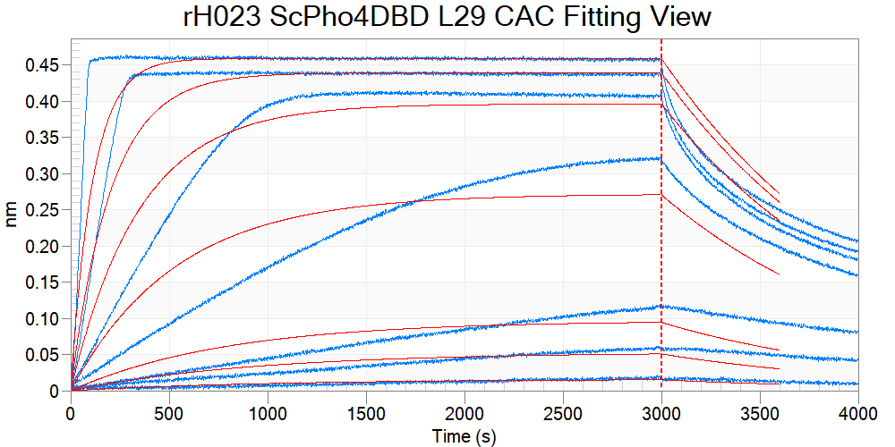

```{r setup, echo=FALSE}
suppressPackageStartupMessages(library(tidyverse))
suppressPackageStartupMessages(library(cowplot))
suppressPackageStartupMessages(library(scales))
```

## Goal

Reanalyze earlier batches of BLI data using the curve fitting method, and compare the dissociation constant $K_d$, as well as kinetic coefficients $k_{on}$ and $k_{off}$ between ScPho4 vs CgPho4 DBDs, against the consensus motif and the nine 1-bp-off variants.

## Data

+---------+-----------+---------+---------------+------------------------+-----------------------------------------+
| Batch   | Exp. Date | Analyte | Concentration | Buffer                 | Notes                                   |
+:========+:==========+:========+:==============+:=======================+:========================================+
| rH016   | 06/2020   | ScPho4  | 2.0 mg/mL     | Hepes<sup>1</sup>      | used immediately after purification     |
+---------+-----------+---------+---------------+------------------------+-----------------------------------------+
| rH016a  | 06/2020   | ScPho4  | 2.0 mg/mL     | Hepes                  | used 1wk after purification             |
+---------+-----------+---------+---------------+------------------------+-----------------------------------------+
| rH017   | 07/2020   | CgPho4  | 2.1 mg/mL     | Phosphate<sup>2</sup>  | used immediately after purification     |
+---------+-----------+---------+---------------+------------------------+-----------------------------------------+
| rH018   | 07/2020   | CgPho4  | 0.6 mg/mL     | Phosphate              | used immediately after purification     |
+---------+-----------+---------+---------------+------------------------+-----------------------------------------+
| rH018a  | 08/2020   | CgPho4  | 1.8 mg/mL     | Phosphate              | used 1wk after purification             |
+---------+-----------+---------+---------------+------------------------+-----------------------------------------+
| rH021a  | 01/2021   | CgPho4  | 3.8 mg/mL     | Phosphate              | peak 1 from Heparin column              |
+---------+-----------+---------+---------------+------------------------+-----------------------------------------+
| rH021b  | 01/2021   | CgPho4  | 2.0 mg/mL     | Phosphate              | peak 2 from Heparin column              |
+---------+-----------+---------+---------------+------------------------+-----------------------------------------+
| rH022   | 01/2021   | mixture | 1.7 mg/mL     | Phosphate              | ScPho4 DBD contaminated with CgPho4 DBD |
+---------+-----------+---------+---------------+------------------------+-----------------------------------------+
| rH023   | 02/2021   | ScPho4  | 1.8 mg/mL     | Phosphate              | peak 1 from Heparin column              |
+---------+-----------+---------+---------------+------------------------+-----------------------------------------+
| rH024   | 01/2022   | ScPho4  | 8.2 mg/mL     | Phosphate              | single peak from Heparin, SEC #29       |
+---------+-----------+---------+---------------+------------------------+-----------------------------------------+
| rH024b  | 01/2022   | ScPho4  | 2.0 mg/mL     | Phosphate              | single peak from Heparin, SEC #32       |
+---------+-----------+---------+---------------+------------------------+-----------------------------------------+

<sup>1</sup> 25mM HEPES pH 7.4, 1M NaCl, 0.5 mM THP <sup>2</sup> 25mM Na2HPO4 pH 7.0, 0.5 M NaCl, 0.5 mM THP

## Questions

1.  Do the $K_d$ estimates from different batches of the protein match each other?
2.  Does CgPho4 have faster kinetics (by $k_{on}$ and $k_{off}$?)

## Analysis

### Load data

```{r,message=FALSE, results='asis'}
datK <- read_tsv("../data/BLI/20220202-kinetic-curve-Kd-estimates-all.tsv") %>% 
  filter(!is.na(Model), grepl("UASp2", Ligand)) %>% 
  mutate(Half_site = factor(str_sub(Ligand,7,9), 
                            levels = c("CAC","AAC","TAC","GAC","CTC","CCC","CGC","CAA","CAT","CAG")),
         Protein = factor(Protein, levels = c("ScPho4 DBD refolded", "CgPho4 DBD refolded"),
                          labels = c("ScPho4-DBD", "CgPho4-DBD")))
cat("Loaded Kd estimates based on kinetic curve fitting ")

datS <- read_tsv("../data/BLI/20220202-steady-state-Kd-estimates-consensus.tsv") %>% 
  filter(grepl("UASp2", Ligand)) %>% 
  mutate(Half_site = factor(str_sub(Ligand,7,9), 
                            levels = c("CAC","AAC","TAC","GAC","CTC","CCC","CGC","CAA","CAT","CAG")),
         Protein = factor(Protein, levels = c("ScPho4 DBD refolded", "CgPho4 DBD refolded"),
                          labels = c("ScPho4-DBD", "CgPho4-DBD")))
cat("Loaded Kd estimates for the consensus oligo based on steady state fitting ")
```

### $K_d$ estimates between batches of the same protein

We will compare the $K_d$ estimates based on different batches of ScPho4 and CgPho4 protein. Note that for ScPho4 DBD the two batches were eluted and stored in different buffers, which could be reason of concern.

```{r}
datK1 <- datK %>%
  # use the latest batch of protein results only, and only use the 1:1 model fitting
  filter(Include, Model == "1:1") %>%
  mutate(fit = "kinetic", Ka = 1/Kd_c/1e6, flag = Chi_sq_c > 3)

ggplot(datK1, aes(x = Half_site, y = Ka, fill = Batch)) + 
  geom_col(position = position_dodge2(.9)) +
  geom_text(aes(label = ifelse(flag, "*", "")), size = 5, col = "red", position = position_dodge2(0.9)) +
  scale_fill_manual(values = c(
    rH016 = "yellowgreen", rH023 = "palegreen4", rH024 = "green4", rH024b = "darkgreen",
    rH017 = "lightskyblue3", rH018 = "steelblue", rH021a = "royalblue1", rH021b = "blue2"
  )) +
  labs(title = "Kd estimates", y = "Kd [nM]") +
  scale_y_log10(breaks = c(10, 100, 1000), labels = c(100, 10, 1)) +
  facet_wrap(~Protein, nrow = 2) + theme_cowplot() + background_grid(major = "y")
  #scale_alpha_manual(values = c(0.4,1)) +
  #scale_y_continuous(trans = reverselog_trans(10)) +
```

**Figure 1. Kd estimates based on kinetic curve fitting.** Three batches of ScPho4 DBD and three batches of CgPho4 DBD protein preps were used to perform BLi against a library of 10 oligos including the consensus CACGTG and nine 1-bp-off half-site mutants. The 6-bp motif is embedded in a 17bp oligo taken from the UASp2 site from the *S. cerevisiae PHO5* promoter. Details of the curve fitting method can be found in the Octet Data Analysis Software Manual (intend to expand on this). Bars with a red asterisk above them indicate the experiments where the kinetic curve fitting had a $\chi^{2}$ value above 3, a reason for concern.

The rH016 batch for ScPho4 had several issues and the results are less consistent with the more recent rH023 and rH024(b) batches. Consider dropping it in the final plot.

Note that all Kd estimates involving the consensus oligo that were based on the kinetic curve fitting had high $\chi^2$ values. This is also apparent if we look at the fit curves:

{width="70%"}

{width="70%"}

**Figure 2. Octet Data Analysis software global kinetic curve fit to both the association and the first 600s of the dissociation phase assuming a 1:1 model.** blue: measured signal intensity over time for different concentrations of the analyte (protein); red: fitted curve. Note the different timescales for ScPho4 (A) and CgPho4 (B). The latter actually reach saturation earlier than the former.

To solve this problem, I used the software to calculate the response values as the averaged signal in the last 5s of the association phase and exported them along with the analyte concentration. I then fit a one-site specific binding with hill coefficient function in Prism 9 and obtained the Kd estimates. The data is also loaded above in `datS`.

```{r}
datC <- bind_rows(kinetic = datK %>% filter(Include, Model == "1:1") %>% 
                    mutate(Kd = Kd_c*1e9, flag = Chi_sq_c > 3, fit = "kinetic") %>%  
                    select(fit, Half_site, Kd, Batch, flag, Protein), 
                  SS = datS %>% filter(R2 > 0.99) %>% 
                    mutate(fit = "SS", flag = FALSE) %>% 
                    select(Kd, Half_site, Batch, flag, Protein),
                  .id = "fit")
datC <- datC %>% 
  mutate(fit = factor(fit, levels = c("SS", "kinetic")), Ka = 1/(Kd/1e3))

datC %>% 
  ggplot(aes(x = Half_site, y = Ka, fill = Batch)) + 
  geom_col(position = position_dodge2(0.9)) +
  #geom_errorbar(aes(ymin = Kd_low, ymax = Kd_up), position = position_dodge2(0.9, padding = 0.4), size = 0.5) +
  scale_fill_manual(values = c(
    rH016 = "yellowgreen", rH023 = "palegreen4", rH024 = "green4", rH024b = "darkgreen",
    rH017 = "lightskyblue3", rH018 = "steelblue", rH021a = "royalblue1", rH021b = "blue2"
  )) +
  labs(title = "Kd estimates", y = "Kd [nM]") +
  scale_y_continuous(trans = "log10", breaks = c(10, 100, 1000), labels = c(100, 10, 1),
                     expand = expansion(mult = c(0, 0.05))) +
  facet_grid(Protein~fit, scale = "free_x", space = "free_x") + 
  theme_minimal_hgrid() + theme(strip.background = element_rect(fill = "gray"))
  #geom_text(aes(label = ifelse(flag, "*", "")), size = 5, col = "red", position = position_dodge2(0.9)) +
  #scale_fill_brewer(type = "div") +
  #labs(title = "Kd estimates", y = "Kd [nM]") +
  #scale_y_log10() + facet_grid(Protein~fit, scale = "free_x", space = "free_x")
```

**Figure 3. Kd estimates for the consensus oligos based on steady state curve fitting compared with kinetic fitting results.** Similar to Figure 1 but now with an additional panel on the left that represent $K_d$ estimates for the consensus oligo using steady state fit. Specifically, a one-site specific binding with hill coefficient model was fit to the response values obtained by averaging the last five seconds of the association phase. The hill coefficients resulting from the fit range between 1-3.6

### Comparing $K_d$ estimates between ScPho4 and CgPho4 DBDs

Now let's remove those experiments with $\chi^2$ values greater than 3, and then pool the different batches for each of the two DBD since the estimates are very similar. This would allow us to compare the two proteins.

```{r}
datC %>% 
  filter(!flag) %>% 
  ggplot(aes(x = Half_site, y = Ka, fill = Protein)) +
  geom_col(position = position_dodge2(0.7)) +
  scale_fill_manual(values=c("yellowgreen", "royalblue3")) + 
  labs(title = "Kd estimates", y = "Kd [nM]") +
  scale_y_continuous(trans = "log10", breaks = c(10, 100, 1000), labels = c(100, 10, 1), 
                     expand = expansion(mult = c(0, 0.05))) +
  theme_minimal_hgrid() +
  theme(legend.position = "top")
```

**Figure 4. Kd estimates for the same set of oligos for ScPho4 DBD and CgPho4 DBD.** The Kd estimates are based on the kinetic curve fitting except for the the consensus oligo, for which the steady state based estimates allowing for cooperativity (through the hill coefficient) were used. Fits with $\chi^2$ values greater than 3 were removed.

```{r}
odd_numbers <- seq(2, nrow(datC),2) # used to draw stripes on even numbered x-values
datC %>% 
  filter(!flag) %>% 
  ggplot(aes(x = Half_site, y = Ka, fill = Protein)) +
  # draw the stripes using geom_rect(); borrowed from https://stackoverflow.com/questions/56961744/draw-alternate-rectangles-in-boxplots-with-facets-r-ggplot2
  # note that the only reason to specify 'data' is so that the length of the xmin, xmax, ymin, ymax vectors 
  # are the same as the number of rows in the data. can be any dummy dataset that satisfy this
  geom_rect(data = datC[odd_numbers, ], xmin = odd_numbers-0.5, xmax = odd_numbers+0.5, 
            ymin = -Inf, ymax = Inf, fill = "grey80", alpha = 0.5) +
  geom_dotplot(binaxis = 'y', stackdir = "center", method = "histodot", 
               position = position_dodge(0.9), binwidth = 0.1) +
  stat_summary(fun = mean, geom = "crossbar", color = "red", width = 0.4, size = 0.3,
               position = position_dodge(0.9), show.legend = FALSE) +
  ylab("Kd [nM]") + xlab("Half site mutants (other half == GTG)") +
  scale_y_log10(breaks = c(10/3, 10, 100/3, 100, 1000/3, 1000), labels = c(300, 100, 30, 10, 3, 1)) +
  scale_fill_manual(values=c("yellowgreen", "royalblue3")) + 
  theme_cowplot() + theme(legend.position = "top") + background_grid(major = "y")
ggsave("imgs/20220202-summarize-compare-Kd-for-Sc-Cg-Pho4.png")
```

**Figure 5. Kd estimates for the same set of oligos for ScPho4 DBD and CgPho4 DBD.** Same as Figure 4, except a dot plot with mean (red bar) was used instead of bar plots.

### Kinetic parameter ($k_{on}$ and $k_{off}$) comparison between batches and between proteins

In earlier analyses I noted that even when the two orthologous DBDs showed simililar affiinity for the same oligo, CgPho4 DBD appears to have a faster kinetics compared with ScPho4.
