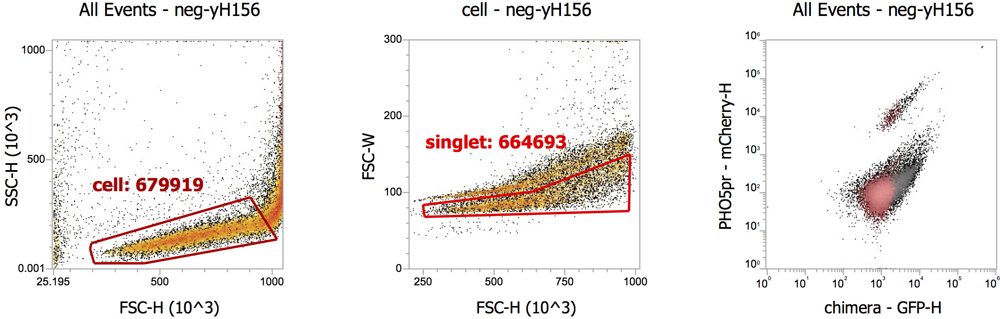
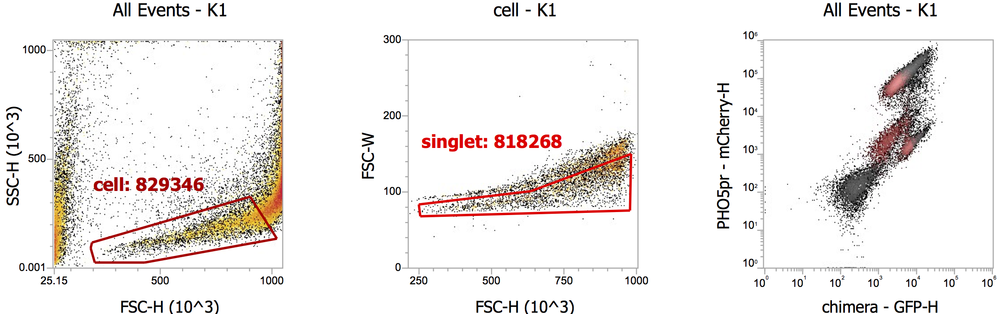
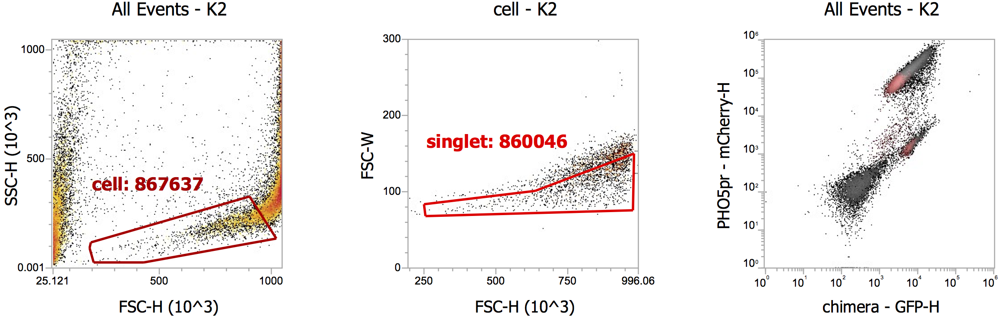
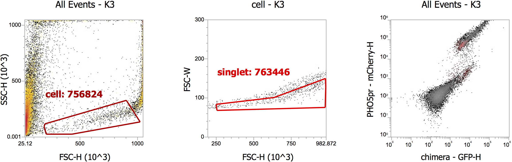
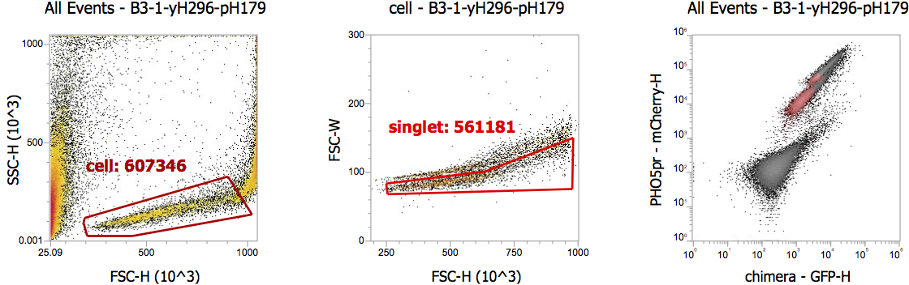
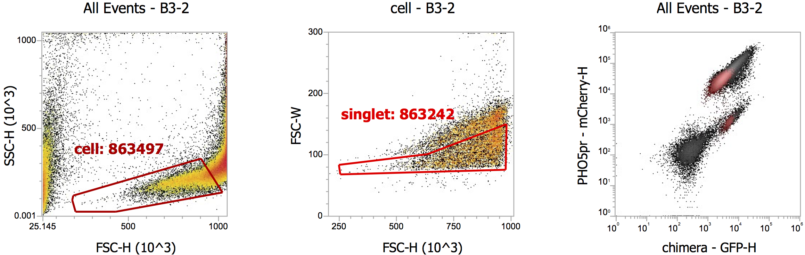

```{r setup}
require(tidyverse)
require(cowplot)
```

## Executive summary
>- [A few](#qc) [technical things](#supfig) to correct in the collection of flow cytometry data, including setting the acquisition threshold, properly drawing the gate and identifying and removing problematic samples.
>- There is substantial variability in Pho4-chimera abundance as measured by mNeon intensity among the chimeric / endogenous constructs, but only in the _pho2∆_ background, while the same plasmids appear to be expressed to a similar level with _PHO2_.
>  - hypotheses?
>  - not necessarily real, see my [2020-12-21](https://rpubs.com/emptyhb/Pho4-GFP-test-20201221) vs [2020-12-23](https://rpubs.com/emptyhb/test-pho4-gfp-20201223) analyses.
>- Chimera activity as measured by RFP/GFP confirms that CgPho4 is Pho2-independent while ScPho4 is dependent. But all chimera tested appear to be Pho2-dependent, in contrast to previous phosphatase assay results. Notably, part of this is due to the apparently higher expression level of the chimera.
>
>**_TODO_**
>
>1. Investigate the effect of growth media (adenine and phosphate levels) on Pho4 chimera expression in _pho2∆_ strains.
>1. Use Western to confirm whether the higher Pho4 abundance for some chimera in _pho2∆_ is real, e.g. pH177
>1. Repeat this experiment to determine if the observations are reproducible.
>1. Validate the flow cytometry results with phosphatase assay (only works for yH295,6 parents)

## Goal

Validate the phosphatase assay results for Xu's Pho4 chimera using the new dual-fluorescence reporter approach.

## Material and methods

Jia subcloned a set of Xu's chimeric Pho4 plasmids into her mNeon tagged backbone (pH173) using the new Golden Gate approach. The complete list of plasmids can be found [here](https://docs.google.com/spreadsheets/d/1yf77ekdoZ9ST0tcKdMqDDjAir2TmtSeCXfdzpxxsgWs/edit?usp=sharing).

All strains in the table below have *pho80::Trp1*

```{r}
samples <- read_csv("20210310-Test-Xu-Chimeras-sample-list.csv", col_types = "ccccclc")
samples
```

Cells are first grown to saturation o/n in SD-leu, diluted in the morning to OD~0.2 in SD-leu and regrown for ~2 doublings. After the culture reached desired OD (mid log phase), cells were spun down and resuspended in PBS and used for flow cytometry. Voltages used are:

| Detector | Voltage | Comments |
|----------|---------|----------|
| FSC      | 350 mV  | I normally use 285 mV |
| SSC      | 350 mV  | NA |
| BL1      | 400 mV  | NA |
| YL2      | 450 mV  | higher than mine |

## Data import
```{r import_data}
dat0 <- read_csv("20210319-Bin-reanalyzed-chimera-test-1-results.csv")
```

## Quality control{#qc}
yLS_K and yJZ_B3, B4 each have one or more biological replicates that showed abnormal patterns on the FCS-H vs SSC-H -- very few cells and a large number of small particles with high SSC-H and low FSC-H. See the [last section](#supfig) of the knitted document.

```{r QC, fig.width=6, fig.height=4}
ggplot(dat0, aes(x = Count, y = Concentration, shape = Pho2, color = Pho4)) + 
  geom_point(size = 2, alpha = 0.8) + 
  xlab("Total # of events recorded") + ylab("Concentration (events/s)") + 
  theme_cowplot() + background_grid() + panel_border()
```
**Figure 1. Acquisition stats show a few samples undersampled and problematic.** Concentration is measured by recorded events / second (y-axis) while total number of recorded events in the "singlet" gate is plotted on the x-axis. Samples are colored by the Pho4 genotype, and the shape reflects the status of Pho2 in the host strain. Lindsey and Jia's samples are mixed.

**_Discussion_**

- First of all, it appears that Lindsey and Jia didn't correctly set the acquisition stop criteria. I suspect that they let the acquisition to stop when the number of events reach 10,000, but didn't set the population to the "singlet" gate. By default, the criteria will apply to ALL events.
- pH179 when transformed into the _pho2∆_ background appears to have trouble growing. We should consider changing the composition of the media to include additional adenine, since _pho2∆_ is sensitive to adenine deprivation. Also, it would be helpful to test and identify a media/growth condition in which the two host strains, with or without Pho2, grow roughly at the same rate.
- A separate issue is that the voltage for the FSC channel is probably too large (350 mV, vs 285 in my experiments). As can be seen in the plot below, many events were cutoff of the right boundary on the FSC-H axis. While those events may not be what we want to include (seems like they have much higher SSC, but not sure if the result will look the same after lowering the voltage), we should still try adjust the FSC voltage to "bring them inside the plot".
    
**Figure 2. Example plots demonstrating potentially too high voltage for FSC**

**Filter data**
```{r}
issues <- c("K-1","K-2","K-3","B3-1","B3-2","B3-3","B4-1") # see below for reasons
dat <- dat0 %>% 
  mutate(id = paste(Sample, Rep, sep = "-")) %>% 
  filter(!id %in% issues) %>% 
  select(-id)
```

## Analysis
### Pho4-GFP expression levels
First look at the background fluorescence level in the GFP channel
```{r fig.width = 4, fig.height=4}
gfp.bg <- dat %>% filter(!FP, Parameter == "chimera-GFP-H") %>% pull(Median) %>% mean()
p0 <- dat %>% 
  filter(!FP, Parameter == "chimera-GFP-H") %>% 
  ggplot(aes(x = Sample, y = Median)) + geom_col(position = position_dodge()) + 
  geom_hline(yintercept = gfp.bg, linetype = "dashed", alpha = 0.6) +
  labs(title = "Background GFP level") + ylab("MFI") + ylim(c(0, 6000)) + 
  theme_cowplot() + theme(axis.text.x = element_text(angle = 90), 
                          plot.title = element_text(hjust = 0.5))
p0
```
**Figure 3. Background GFP in strains with no mNeon.** MFI: Median fluorescent intensity. Dotted line shows the average of all negative samples and will be used for background subtraction in later analyses.

It's good to see that all the negative strains have the same level of background in the BL1 (GFP) channel. Unfortunately we didn't include any strain that have strong RFP but no GFP so as to evaluate the spillover of the RFP signal into the GFP channel.

Next, we can examine the Pho4-GFP levels for the different contructs, in _PHO2_ or _pho2∆_ backgrounds, and transformed into two genetic backgrounds.
```{r, fig.width=8, fig.height=4}
p1 <- dat %>% filter(FP, Parameter == "chimera-GFP-H") %>% 
  ggplot(aes(x = Pho4, y = Median, alpha = Group)) + 
  scale_alpha_discrete("User", range = c(0.5, 1)) +
  geom_bar(aes(fill = Pho4), stat = "identity", position = position_dodge2()) + 
  stat_summary(fun = "mean", geom = "crossbar", colour = "red", size = 0.2, 
               position = position_dodge2(), show.legend = F) +
  geom_hline(yintercept = gfp.bg, linetype = "dashed", alpha = 0.6) +
  facet_wrap(~Pho2, nrow = 1, scales = "free_x") +
  ylab("MFI") + scale_y_continuous(expand = expansion(mult = c(0.01,0.1))) +
  labs(title = "GFP fluorescent intensity (arbitrary units)") +
  theme_cowplot() + theme(axis.text.x = element_text(angle = 40, vjust = 1, hjust = 1))

p1
#left_col <- plot_grid(p0, NULL, nrow = 2, rel_heights = c(2,1))
#plot_grid(left_col, p1, ncol = 2, rel_widths = c(1,4))
```
**Figure 4. Pho4-chimera abundance measured by mNeon fluorescent intensity.** Dotted line indicates the background level of GFP. Each bar represents one biological replicate. Jia and Lindsey's samples were grouped by the plasmid they contain and arranged side-by-side to show their similarity or difference. The red lines indicate the mean for each group.

**_Discussion_**

- There is great variability among Pho4 chimeric constructs, where pH177 showed the highest expression level by fluorescent protein abundance
- There appear to be more chimera protein in the _pho2∆_ background than in the _PHO2_ wild type background. 

    I've seen a similar picture in [one of my previous experiments](https://rpubs.com/emptyhb/Pho4-GFP-test-20201221), but a [repeat of that experiment](https://rpubs.com/emptyhb/test-pho4-gfp-20201223) didn't reproduce the phenomenon. 
    
    While I initially suspected some sort of transcriptional feedback -- somehow lack of Pho2 induces Pho4 to be more highly expressed -- the lack of reproducibility in the second try made me think it could have to do with how _PHO2_ and _pho2∆_ strains grow. We know that Pho2 is also responsible for regulating de novo purine synthesis and as such, _pho2∆_ strains are extremely sensitive to purine deprivation. 
    
    What if we add additional adenine to our media for growing the strains (following the low autofluorescence media recipe perhaps)? One idea is to test a range of media with different concentrations of adenine and phosphate, and record growth curves for the _PHO2_ and _pho2∆_ strains, to determine if there is any difference in growth rate and hopefully identify a condition that shows no difference between the two.

### PHO5p-RFP reporter expression
```{r, fig.width=6, fig.height=4}
rfp.bg <- dat %>% filter(!FP, Parameter == "PHO5pr-mCherry-H") %>% pull(Median) %>% mean()
rfp.basal <- dat %>% filter(FP, Parameter == "PHO5pr-mCherry-H", Pho4 == "pho4del") %>% pull(Median) %>% mean()
dat %>% 
  filter(Parameter == "PHO5pr-mCherry-H", xor(!FP, Pho4 == "pho4del")) %>% 
  ggplot(aes(x = Sample, y = Median)) + geom_col(position = position_dodge()) + 
  ylim(c(0, 6000)) + ylab("Median Fluorescent Intensity") +
  labs(title = "RFP background fluorescence (yH156) and\nbasal expression w/o Pho4 (yH295-373)") + 
  theme_cowplot()
```
**Figure 5. Background RFP level and basal PHO5pr-mCherry expression.**

```{r, fig.height=6, fig.width=8}
p1 <- dat %>% 
  filter(FP, Pho4 != "pho4del") %>% 
  mutate(MFI = Median / 1000) %>% 
  ggplot(aes(x = Pho4, y = MFI, fill = Pho4, alpha = Group)) + scale_alpha_discrete("User", range = c(0.5, 1)) +
  geom_col(position = position_dodge2(width = 0.9)) +
  #stat_summary(fun = "mean", geom = "crossbar", color = "red", size = 0.3, width = 0.3) +
  geom_hline(aes(yintercept = ifelse(Parameter == "chimera-GFP-H", gfp.bg/1000, rfp.basal/1000)), linetype = 2, alpha = 0.6) +
  facet_grid(Pho2 ~ Parameter, scales = "free", space = "free_y") + ylab("Median Fluorescent Intensity (x1000)") +
  #scale_color_brewer(type = "qual") + scale_color_manual(values = c("red", NA)) +
  coord_flip() + scale_y_continuous(expand = expansion(mult = c(0.01,0.1))) +
  theme_cowplot() + background_grid(major = "x", minor = "x") + panel_border()
p1
```
**Figure 6. Pho4-GFP and PHO5pr-RFP intensities plotted side-by-side.** The raw fluorescent intensities in arbitrary units are plotted on the x-axis. Color of the bars are meant to highlight the different Pho4 chimera (or endogenous Pho4) constructs. To distinguish and compare the results from Jia and Lindsey's experiments, the two sets of results were combined and grouped by the Pho4 chimera, and plotted side-by-side with Jia's results shown in a lighter (semi-transparent) color. The dashed lines in the GFP panel indicates background fluorescence, while the dashed line in the RFP channel indicates basal mCherry levels (in strains with the PHO5pr-mCherry reporter but lacking Pho4).

**_Discussion_**

- For the majority of the Pho4 chimera, their expression levels as judged by the GFP intensity are similar between Jia and Lindsey's strains, which is expected. However, a few constructs did show differences, e.g. pH193, pH180 and pH177. Interestingly, the differences are only seen in the _pho2∆_ background.
- For CgPho4 (pH188), the PHO5pr-mCherry reporter levels are comparable in _pho2∆_ vs _PHO2_ wild type backgrounds, while for ScPho4 (pH194), the reporter level without Pho2 is clearly the lowest compared with all the chimera and CgPho4.
- In _PHO2_ wild type background, Lindsey's strains show more variability among the Pho4 chimera, e.g. pH177 and pH180 induce higher levels of reporter expression than either pure ScPho4 or pure CgPho4 (although, pH177 seems to be at ~2 fold more abundant than the others).


### Normalized Pho4 chimera activity with and without Pho2
We will first transform the raw GFP and RFP intensities to make them more interpretable. For the GFP intensity, as there is a substantial background, we will subtract the background from all the GFP-containing strains to obtain the meaningful measure for Pho4 protein levels. For RFP, we will similarly subtract the background, which is minimal (~100 a.u. w/o mCherry reporter). Since what we are interested in is not the absolute level of reporter expression but the fold induction compared with the _pho4∆_ strains, we will divide the background subtracted RFP levels in the experimental strain by the basal expression level. Then, the induction fold change, call it M, is a function of both Pho4 chimera's activity (A) in each strain and also the protein level of the chimera (C) (other factors matter, too, but we assume they are the same among all strains for simplicity). We will further assume that M is proportional to both S and C (may not be correct), which leads to $M = kSA$. Rearranging this equation, we get the quantity we are interested in, i.e. activity, as $A/k = M/S$. Since $k$ is a constant and we are only interested in the relative values of activity among the chimera, we can let $A' = A/k$, and for simplicity, we will equate $A'$ with $A$ below. 
```{r transform}
dat1 <- dat %>% 
  # remove all the control strains, including the parents, and only retain the experimental ones
  filter(FP, Pho4 != "pho4del") %>% 
  select(Group, Sample, Rep, Pho4, Pho2, Pho5RFP, Parameter, Median) %>% 
  pivot_wider(names_from = Parameter, values_from = Median) %>% 
  mutate(GFP.noBG = `chimera-GFP-H` - gfp.bg,
         RFP.noBG = `PHO5pr-mCherry-H` - rfp.bg,
         RFP.FC = RFP.noBG / rfp.basal,
         nRFP.FC = RFP.FC / GFP.noBG * median(GFP.noBG, na.rm = T))
```

```{r, fig.height=6, fig.width=8}
p2 <- dat1 %>% 
  pivot_longer(cols = c(RFP.FC, nRFP.FC), names_to = "Parameter", values_to = "Value") %>%
  mutate(Parameter = factor(Parameter, levels = c("RFP.FC", "nRFP.FC"), 
                            labels = c("PHO5 fold induction", "PHO5 induction / Pho4-GFP"))) %>% 
  ggplot(aes(x = Pho4, y = Value, fill =  Pho4, alpha = Group)) + scale_alpha_discrete("User", range = c(0.5, 1)) +
  geom_col(position = position_dodge2(width = 0.9, preserve = "total")) +
  stat_summary(fun = "mean", geom = "crossbar", position = position_dodge2(width = 0.9), 
               color = "red", size = 0.3, show.legend = F) +
  #geom_text(aes(label = ifelse(Sample %in% issues, "*", ""), hjust = -0.2, vjust = 0.8), color = "black", size = 5) +
  geom_hline(yintercept = 1, linetype = 2) +
  facet_grid(Pho2 ~ Parameter, scales = "free", space = "free_y") +
  #scale_fill_brewer(type = "div", drop = F) + scale_color_manual(values = c("red", NA)) +
  coord_flip() + scale_y_continuous(expand = expansion(mult=c(0.01,0.1))) + ylab("Fold Induction") + xlab("") +
  theme_bw()

p2
```
**Figure 7. Composite plot including Pho4 abundance, _PHO5_ reporter strength and fold induction values.** Pho4-GFP and PHO5p-mCherry intensities were quantified using flow cytometry. Pho4 chimera were labeled by the plasmid ID (see table at the top for details) and are listed on the vertical axis. Each bar is one biological replicate, with Jia and Lindsey's strains grouped by the plasmid transformed and arranged side-by-side (Jia's data are lighter in color). The red vertical bar indicate the mean value across biological replicates for either Jia or Lindsey's strains. In **(A)**, the x-axis values represent the Median Fluorescent Intensity (MFI, arbitury units) for either Pho4-GFP or PHO5pr-mCherry after subtracting the background (based on strains without the corresponding fluorescent protein). In **(B)**, the fold change for _PHO5_ reporter is calculated as the background-subtracted RFP level divided by the basal expression level. The normalized induction on the right column is calculated by dividing the induction fold change from the left column by the corresponding Pho4-GFP (background subtracted) levels and multiplied by the median Pho4-GFP levels of all strains. The dashed lines in both columns indicate the induction fold change of 1, i.e. no change compared to the _pho4∆_ strains. 

**_Discussion_**

- Other than CgPho4 (pH188), the rest seem not different from ScPho4 in that they have little activity without Pho2.
- We need to first figure out the Pho4 chimera level in _pho2∆_ background, as the unnormalized ratio (in **B** left column) for a few of the chimera do seem to be above ScPho4, but after the normalization all went down, because the corresponding chimera appear to be expressed at a higher level. What's curious is that the higher expression is only in the _pho2∆_ background.
- We also need to repeat this experiment to examine the variability.

## Supplementary figures{#supfig}
Here are plots that demonstrate the issues with some of the samples:






