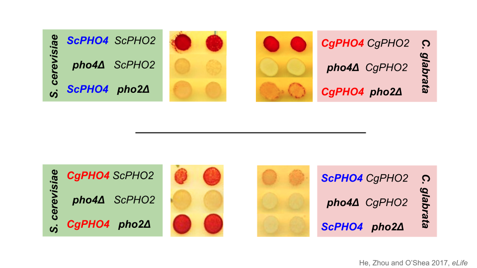

```{r setup, include=FALSE}
knitr::opts_chunk$set(
  echo = TRUE,
  fig.align="center",
  eval.after="fig.cap"
)
```

# Prerequisites 

### Base R installation

```{r installR, eval=TRUE}
R.version.string  # Check R version
```

### Tidyverse Packages

```{r, echo=TRUE}
if (!requireNamespace("tidyverse", quietly = TRUE))
  install.packages("tidyverse")
suppressPackageStartupMessages(library(tidyverse))

# Cowplot (supplement ggplot2)
if (!requireNamespace("cowplot", quietly = TRUE))
  install.packages("cowplot")
suppressPackageStartupMessages(library(cowplot))
```

---

# Question

## Which region of CgPho4 underlies its reduced Pho2-dependence?


---

# Read the data

```{r echo=TRUE, tidy=FALSE, warning=FALSE}
samples <- read_csv("20210402-Lindsey-Jia-test-autosampler-sample-list.csv",
                    col_types = "ccccclc")
dat0 <- read_csv("20210416-bin-reexported-results.csv", col_types = cols())
```

--

### Quality control

A few strains didn't grow well, including 

```{r tidy=FALSE}
issues <- unique(dat0$Sample[dat0$Count < 5000])
samples %>% filter(Sample %in% issues) %>% select(-Content) %>% as.data.frame()
```

---

# Quality control (continued)

Also check the robust CV to identify any samples with unusally high variability within the sample

```{r, echo=FALSE, fig.width=8, fig.height=5, fig.align='left'}
qplot(x = rCV, data = dat0, geom = "histogram", bins = 25, fill = Count < 5000) + 
  xlab("robust %CV") + ylab("Frequency") +
  facet_wrap(~ Parameter, nrow = 2) +
  scale_fill_manual(values = c("grey30","gold2"))
```

    Samples with < 5000 events were flagged and excluded.
    
```{r echo=FALSE}
dat <- dat0 %>% 
  mutate(flag = ifelse(Count < 5000 | rCV > 75, TRUE, FALSE))

# let's also create a wide format for easier plotting functions
datw <- dat %>% 
  filter(FP, !flag) %>% 
  select(-ID, -FP, -Count, -Perc_gated, -CV, -rCV) %>% 
  pivot_wider(names_from = Parameter, values_from = Median) %>% 
  rename(Pho4GFP = `Pho4-GFP-H`, PHO5pRFP = `PHO5pr-mCherry-H`)
```

---

# Analysis - XPho4 expression levels

First let's look at the background fluorescence level in the GFP channel

```{r echo=FALSE, fig.width = 5, fig.height=5, fig.align='left'}
gfp.bg <- dat %>% filter(!FP, Parameter == "Pho4-GFP-H") %>% pull(Median) %>% mean()
dat %>% 
  filter(!FP, Parameter == "Pho4-GFP-H") %>% 
  ggplot(aes(x = Sample, y = Median)) + geom_col(position = position_dodge()) + 
  geom_hline(yintercept = gfp.bg, linetype = "dashed", alpha = 0.6) +
  labs(title = "Background GFP level") + ylab("MFI") + ylim(c(0, 6000)) + 
  theme_cowplot() + theme(axis.text.x = element_text(angle = 90), 
                          plot.title = element_text(hjust = 0.5))
```

It's good that all negatives are similar.

---

# Analysis: XPho4 expression level variability

Next, we can examine the Pho4-GFP levels for the different constructs, in _PHO2_ or _pho2∆_ backgrounds, and transformed into two genetic backgrounds.

```{r, echo=FALSE, fig.width=10, fig.height=5, fig.align='left', warning=FALSE}
p1 <- dat %>% filter(FP, Parameter == "Pho4-GFP-H") %>% 
  ggplot(aes(x = Pho4, y = Median, alpha = Group)) + 
  geom_bar(aes(fill = Pho4), stat = "identity", position = position_dodge2(.9)) +
  geom_text(aes(label = ifelse(flag, "*","")), alpha = 1, size = 5, position = position_dodge2(.9)) +
  stat_summary(fun = "mean", geom = "crossbar", colour = "red", size = 0.2, 
               position = position_dodge2(.9), show.legend = F) +
  geom_hline(yintercept = gfp.bg, linetype = "dashed", alpha = 0.6) +
  scale_alpha_discrete("User", range = c(0.5, 1)) +
  facet_wrap(~Pho2, nrow = 1, scales = "free_x") +
  ylab("MFI") + scale_y_continuous(expand = expansion(mult = c(0.01,0.1))) +
  labs(title = "GFP fluorescent intensity (arbitrary units)") +
  theme_cowplot() + theme(axis.text.x = element_text(angle = 40, vjust = 1, hjust = 1)) +
  background_grid(major = "y", minor = "y", size.major = 0.4)

p1
```

---

# Analysis: XPho4 expression level variability

### What does the data look like

```{r}
head(datw[sample(1:nrow(datw),5),]) %>% as.data.frame()
```

---

# Analysis: XPho4 expression level variability

### What do we want to visualize?

Pho4-GFP intensity for each sample, grouped by biological replicates, researcher and _PHO2_ presence or absence

```{r, fig.width=10, fig.height=4, warning=FALSE}
ggplot(datw, aes(x = Sample, y = Pho4GFP)) + geom_col()
```

---

# Analysis: XPho4 expression level variability

Add some grouping

```{r, fig.width=10, fig.height=4, warning=FALSE}
ggplot(datw, aes(x = Sample, y = Pho4GFP, fill = Group)) + geom_col()
```

---

# Analysis: XPho4 expression level variability

Separate the two researchers

```{r, fig.width=10, fig.height=4, warning=FALSE}
ggplot(datw, aes(x = Pho4, y = Pho4GFP)) + geom_col() +
  facet_wrap(~Group)
```

---

# Analysis: XPho4 expression level variability

Separate the biological replicates

```{r, fig.width=10, fig.height=4, warning=FALSE}
ggplot(datw, aes(x = Pho4, y = Pho4GFP)) + geom_col() +
  facet_wrap(~Group)
```

