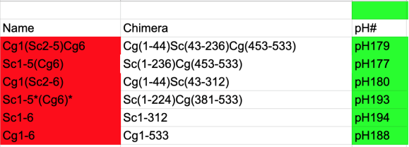

```{r setup}
suppressPackageStartupMessages(require(tidyverse))
suppressPackageStartupMessages(require(cowplot))
```

## Previous results
In the latest experiment [2021-03-09](https://rpubs.com/emptyhb/jia-lindsey-pho4-chimera-test-20210310) we found several issues, including strain growth defects especially in the _pho2∆_ background, and that all chimera tested appear to be Pho2-dependent, in contrast to previous and recent phosphatase plate assay results. Part of the reason some of these chimera show little activity in _pho2∆_ background is due to the apparently higher expression level of the chimera in that background.

**_TODO from last experiment_**

1. Investigate the effect of growth media (adenine and phosphate levels) on Pho4 chimera expression in _pho2∆_ strains.
1. Use Western to confirm whether the higher Pho4 abundance for some chimera in _pho2∆_ is real, e.g. pH177
1. Repeat this experiment to determine if the observations are reproducible.
1. Validate the flow cytometry results with phosphatase assay (only works for yH295,6 parents)

## Goal

This experiment won't address many of the questions above. The goals of this experiment is to 1) repeat the previous experiment to make sure that whatever unexpected observations are reproducible and 2) test the autosampler.

## Executive summary of this analysis
- Added pH124 in _pho2∆_ background, which is useful for determining the activity of ScPho4 w/o Pho2. But more replicates are needed.
- Jia should include yH296/295, i.e. the host strains, into the experiment.
- A few samples with pH179 in _PHO2_ wild type background didn't grow well, similar to our observation last time.
- The overall pattern of Pho4-chimera expression and normalized chimera activity with and without Pho2 are similar to the last experiment, which is to say the issues we raised in the previous experiment do need to be addressed.

## Material and methods


**Figure 1. Pho4 chimera genotypes and the corresponding plasmid ID used in this experiment.**

All strains in the table below have *pho80::Trp1*

```{r}
samples <- read_csv("../../data/20210402-Lindsey-Jia-test-autosampler-sample-list.csv", col_types = "ccccclc")
samples
```

Cells carrying Pho4-chimera plasmids (Leu2+) are first grown to saturation o/n in SD-leu, diluted in the morning to OD~0.2 in SD-leu and regrown for ~2 doublings. Control strains such as yH156 and yH372,373 are grown the same way, only that SC media is used instead. After the culture reached desired OD (mid log phase), cells were spun down and resuspended in PBS and used for flow cytometry. Voltages used are:

| Detector | Voltage | Comments |
|----------|---------|----------|
| FSC      | 350 mV  | I normally use 285 mV |
| SSC      | 350 mV  | NA |
| BL1      | 400 mV  | NA |
| YL2      | 450 mV  | higher than mine |

## Data
### Import
```{r import_data, message=FALSE}
dat0 <- read_csv("20210416-bin-reexported-results.csv")
```

### Quality control{#qc}
A few strains didn't grow well, including 
```{r}
issues <- unique(dat0$Sample[dat0$Count < 5000])
samples %>% filter(Sample %in% issues)
```
So the problem is with pH179 (Cg1Sc2-5Cg6) in the _PHO2_ wild type background.

Also check the robust CV to identify any samples with unusally high variability within the sample
```{r}
qplot(x = rCV, data = dat0, geom = "histogram", bins = 25, fill = Count < 5000) + 
  xlab("robust %CV") + ylab("Frequency") +
  facet_wrap(~ Parameter, nrow = 2) +
  scale_fill_manual(values = c("grey30","gold2"))
```
**Figure 2. Distribution of robust %CV measure for GFP and RFP channels for each sample.** Samples with growth issues are shown in yellow. 
### Filter the data
Rather than removing the data, I'll create a new variable to flag the problematic samples.
```{r}
dat <- dat0 %>% 
  mutate(flag = ifelse(Count < 5000 | rCV > 75, TRUE, FALSE))
```


## Analysis
### Pho4-GFP expression levels
First look at the background fluorescence level in the GFP channel
```{r fig.width = 4, fig.height=4}
gfp.bg <- dat %>% filter(!FP, Parameter == "Pho4-GFP-H") %>% pull(Median) %>% mean()
p0 <- dat %>% 
  filter(!FP, Parameter == "Pho4-GFP-H") %>% 
  ggplot(aes(x = Sample, y = Median)) + geom_col(position = position_dodge()) + 
  geom_hline(yintercept = gfp.bg, linetype = "dashed", alpha = 0.6) +
  labs(title = "Background GFP level") + ylab("MFI") + ylim(c(0, 6000)) + 
  theme_cowplot() + theme(axis.text.x = element_text(angle = 90), 
                          plot.title = element_text(hjust = 0.5))
p0
```
**Figure 3. Background GFP in strains with no mNeon.** MFI: Median fluorescent intensity. Dotted line shows the average of all negative samples and will be used for background subtraction in later analyses.

It's good to see that all the negative strains have the same level of background in the BL1 (GFP) channel. Unfortunately we didn't include any strain that have strong RFP but no GFP so as to evaluate the spillover of the RFP signal into the GFP channel.

Next, we can examine the Pho4-GFP levels for the different constructs, in _PHO2_ or _pho2∆_ backgrounds, and transformed into two genetic backgrounds.
```{r, fig.width=8, fig.height=4}
p1 <- dat %>% filter(FP, Parameter == "Pho4-GFP-H") %>% 
  ggplot(aes(x = Pho4, y = Median, alpha = Group)) + 
  geom_bar(aes(fill = Pho4), stat = "identity", position = position_dodge2(.9)) +
  geom_text(aes(label = ifelse(flag, "*","")), alpha = 1, size = 5, position = position_dodge2(.9)) +
  stat_summary(fun = "mean", geom = "crossbar", colour = "red", size = 0.2, 
               position = position_dodge2(.9), show.legend = F) +
  geom_hline(yintercept = gfp.bg, linetype = "dashed", alpha = 0.6) +
  scale_alpha_discrete("User", range = c(0.5, 1)) +
  facet_wrap(~Pho2, nrow = 1, scales = "free_x") +
  ylab("MFI") + scale_y_continuous(expand = expansion(mult = c(0.01,0.1))) +
  labs(title = "GFP fluorescent intensity (arbitrary units)") +
  theme_cowplot() + theme(axis.text.x = element_text(angle = 40, vjust = 1, hjust = 1)) +
  background_grid(major = "y", minor = "y", size.major = 0.4)

p1
```
**Figure 4. Pho4-chimera abundance measured by mNeon fluorescent intensity.** Dotted line indicates the background level of GFP. Each bar represents one biological replicate. Jia and Lindsey's samples were grouped by the plasmid they contain and arranged side-by-side to show their similarity or difference. The red lines indicate the mean for each group.

**_Discussion_**

- The overall trend is similar to what we saw in the [last experiment](https://rpubs.com/emptyhb/jia-lindsey-pho4-chimera-test-20210310), i.e. significant variability among the chimera, with pH177 showing the highest expression level by fluorescent protein abundance specifically in the _pho2∆_ background.
- Different from last time however, there doesn't appear to be more Pho4 chimera expressed in the _pho2∆_ background compared with in the _PHO2_ wild type background, except for pH177.
- Only one replicate of pH124, precluding conclusions about its Pho4 expression and activity w/ and w/o Pho2.

### PHO5p-RFP reporter expression
```{r, fig.width=4, fig.height=4}
rfp.bg <- dat %>% filter(!FP, Parameter == "PHO5pr-mCherry-H") %>% pull(Median) %>% mean()
rfp.basal <- dat %>% filter(FP, Parameter == "PHO5pr-mCherry-H", Pho4 == "pho4del") %>% pull(Median) %>% mean()
dat %>% 
  filter(Parameter == "PHO5pr-mCherry-H", xor(!FP, Pho4 == "pho4del")) %>% 
  ggplot(aes(x = Sample, y = Median)) + geom_col(position = position_dodge()) + 
  ylim(c(0, 6000)) + ylab("Median Fluorescent Intensity") +
  theme_cowplot()
```
**Figure 5. Background RFP level and basal PHO5pr-mCherry expression.** yH156 has no RFP reporter, while yH372 and yH373 have the reporter but lack Pho4.

```{r, fig.height=6, fig.width=8}
p1 <- dat %>% 
  filter(FP, Pho4 != "pho4del") %>% 
  mutate(MFI = Median / 1000) %>% 
  ggplot(aes(x = Pho4, y = MFI, alpha = Group)) + 
  scale_alpha_discrete("User", range = c(0.5, 1)) +
  geom_col(aes(fill = Pho4), position = position_dodge2(0.9)) +
  geom_text(aes(label = ifelse(flag, "*","")), alpha = 1, size = 5, position = position_dodge2(.9)) +
  geom_hline(aes(yintercept = ifelse(Parameter == "Pho4-GFP-H", gfp.bg/1000, rfp.basal/1000)), linetype = 2, alpha = 0.6) +
  facet_grid(Pho2 ~ Parameter, scales = "free", space = "free_y") + ylab("Median Fluorescent Intensity (x1000)") +
  #scale_color_brewer(type = "qual") + scale_color_manual(values = c("red", NA)) +
  coord_flip() + scale_y_continuous(expand = expansion(mult = c(0.01,0.1))) +
  theme_cowplot() + background_grid(major = "x", minor = "x") + panel_border()
p1
```
**Figure 6. Pho4-GFP and PHO5pr-RFP intensities plotted side-by-side.** The raw fluorescent intensities in arbitrary units are plotted on the x-axis. Color of the bars are meant to highlight the different Pho4 chimera (or endogenous Pho4) constructs. To distinguish and compare the results from Jia and Lindsey's experiments, the two sets of results were combined and grouped by the Pho4 chimera, and plotted side-by-side with Jia's results shown in a lighter (semi-transparent) color. The dashed lines in the GFP panel indicates background fluorescence, while the dashed line in the RFP channel indicates basal mCherry levels (in strains with the PHO5pr-mCherry reporter but lacking Pho4). Astrisks indicate that the corresponding measurement has large variability (robust %CV > 75%) or that the strain didn't grow well (Count < 5000).

**_Discussion_**

- For CgPho4 (pH188), the PHO5pr-mCherry reporter levels are comparable in _pho2∆_ vs _PHO2_ wild type backgrounds, while for ScPho4 (pH194), the reporter level without Pho2 is clearly the lowest compared with all the chimera and CgPho4.
- pH124 showed unexpected results. It is supposed to carry a pRS315-ScPho4-mNeon plasmid and should behave similarly to pH194, and yet the results here suggest that it drove expression of the reporter without Pho2 but didn't induce expression with Pho2. I suspect the two samples have been labeled wrong.


### Normalized Pho4 chimera activity with and without Pho2
We will first transform the raw GFP and RFP intensities to make them more interpretable. For the GFP intensity, as there is a substantial background, we will subtract the background from all the GFP-containing strains to obtain the meaningful measure for Pho4 protein levels. For RFP, we will similarly subtract the background, which is minimal (~100 a.u. w/o mCherry reporter). Since what we are interested in is not the absolute level of reporter expression but the fold induction compared with the _pho4∆_ strains, we will divide the background subtracted RFP levels in the experimental strain by the basal expression level. Then, the induction fold change, call it M, is a function of both Pho4 chimera's activity (A) in each strain and also the protein level of the chimera (C) (other factors matter, too, but we assume they are the same among all strains for simplicity). We will further assume that M is proportional to both S and C (may not be correct), which leads to $M = kSA$. Rearranging this equation, we get the quantity we are interested in, i.e. activity, as $A/k = M/S$. Since $k$ is a constant and we are only interested in the relative values of activity among the chimera, we can let $A' = A/k$, and for simplicity, we will equate $A'$ with $A$ below. 
```{r transform}
dat1 <- dat %>% 
  # remove all the control strains, including the parents, and only retain the experimental ones
  filter(FP, Pho4 != "pho4del") %>% 
  select(Group, Sample, Rep, Pho4, Pho2, Pho5RFP, Parameter, Median) %>% 
  pivot_wider(names_from = Parameter, values_from = Median) %>% 
  mutate(GFP.noBG = `Pho4-GFP-H` - gfp.bg,
         RFP.noBG = `PHO5pr-mCherry-H` - rfp.bg,
         RFP.FC = RFP.noBG / rfp.basal,
         nRFP.FC = RFP.FC / GFP.noBG * median(GFP.noBG, na.rm = T))
```

Here are the Chimera genotypes again:

```{r, fig.height=6, fig.width=8}
p2 <- dat1 %>% 
  pivot_longer(cols = c(RFP.FC, nRFP.FC), names_to = "Parameter", values_to = "Value") %>%
  mutate(Parameter = factor(Parameter, levels = c("RFP.FC", "nRFP.FC"), 
                            labels = c("PHO5 fold induction", "PHO5 induction / Pho4-GFP"))) %>% 
  ggplot(aes(x = Pho4, y = Value, fill =  Pho4, alpha = Group)) + scale_alpha_discrete("User", range = c(0.5, 1)) +
  geom_col(position = position_dodge2(width = 0.9, preserve = "total")) +
  stat_summary(fun = "median", geom = "crossbar", position = position_dodge2(width = 0.9), 
               color = "red", size = 0.3, show.legend = F) +
  #geom_text(aes(label = ifelse(Sample %in% issues, "*", ""), hjust = -0.2, vjust = 0.8), color = "black", size = 5) +
  geom_hline(yintercept = 1, linetype = 2) +
  facet_grid(Pho2 ~ Parameter, scales = "free", space = "free_y") +
  #scale_fill_brewer(type = "div", drop = F) + scale_color_manual(values = c("red", NA)) +
  coord_flip() + scale_y_continuous(expand = expansion(mult=c(0.01,0.1))) + ylab("Fold Induction") + xlab("") +
  theme_bw()

p2
```
**Figure 7. Composite plot including Pho4 abundance, _PHO5_ reporter strength and fold induction values.** Pho4-GFP and PHO5p-mCherry intensities were quantified using flow cytometry. Pho4 chimera were labeled by the plasmid ID (see table at the top for details) and are listed on the vertical axis. Each bar is one biological replicate, with Jia and Lindsey's strains grouped by the plasmid transformed and arranged side-by-side (Jia's data are lighter in color). The red vertical bar indicate the _median_ value across biological replicates for either Jia or Lindsey's strains. In **(A)**, the x-axis values represent the Median Fluorescent Intensity (MFI, arbitury units) for either Pho4-GFP or PHO5pr-mCherry after subtracting the background (based on strains without the corresponding fluorescent protein). In **(B)**, the fold change for _PHO5_ reporter is calculated as the background-subtracted RFP level divided by the basal expression level. The normalized induction on the right column is calculated by dividing the induction fold change from the left column by the corresponding Pho4-GFP (background subtracted) levels and multiplied by the median Pho4-GFP levels of all strains. The dashed lines in both columns indicate the induction fold change of 1, i.e. no change compared to the _pho4∆_ strains. 

**_Discussion_**

- As mentioned above, the w/ and w/o Pho2 strains containing pH124 may have been mixed up as they show the opposite pattern than expected.
- Lindsey's strains appear to give higher normalized activity in the _PHO2_ wild type background compared with Jia's.
- We need a better measurement of the ScPho4 behavior without Pho2. pH194 showed high variability in the RFP channel in Lindsey's samples and thus the results are difficult to compare with previous ones.

### Plot Pho2-dependence on a scatter plot
Here we want to put each Pho4 chimera on a 2D scatter plot, where the x-axis values represent their activity **with Pho2** and the y-axis values their activity **without Pho2**.
```{r}
dat2 <- dat1 %>% 
  group_by(Group, Sample, Pho4, Pho2) %>% 
  summarize(mean = mean(nRFP.FC), sd = sd(nRFP.FC), .groups = "drop") %>% 
  pivot_wider(id_cols = c(Group, Pho4), names_from = Pho2, values_from = c(mean, sd))
```

```{r, fig.width=5, fig.height=4}
dat2 %>% 
  ggplot(aes(x = mean_ScPho2, y = mean_pho2del, color = Pho4, shape = Group)) +
  geom_point(size = 2.5) +
  geom_errorbar(aes(xmin = mean_ScPho2 - sd_ScPho2, xmax = mean_ScPho2 + sd_ScPho2), color = "grey20", size = 0.2, width = 1) +
  geom_errorbar(aes(ymin = mean_pho2del - sd_pho2del, ymax = mean_pho2del + sd_pho2del), color = "grey20", size = 0.2, width = 1) +
  geom_abline(slope = 1, intercept = 0, linetype = 2, color = "grey20") +
  xlab("Activity with Pho2") + ylab("Activity without Pho2")
```
**Figure 9. Pho4 chimera dependence on Pho2 measured by the reporter fold induction with and without Pho2.** Each dot represents the mean normalized fold induction of the reporter by the corresponding Pho4 chimera either with (x value) or without (y value) Pho2. The errorbars represent the +/- standard deviation of all the biological replicates. As noted above, the lone pH124 dot above the diagnal line is likely due to mislabeling. Except for CgPho4 (pH188), all other constructs, including ScPho4 and all the chimeric ones, appear to form a single cluster that cannot be distinguished from each other.
