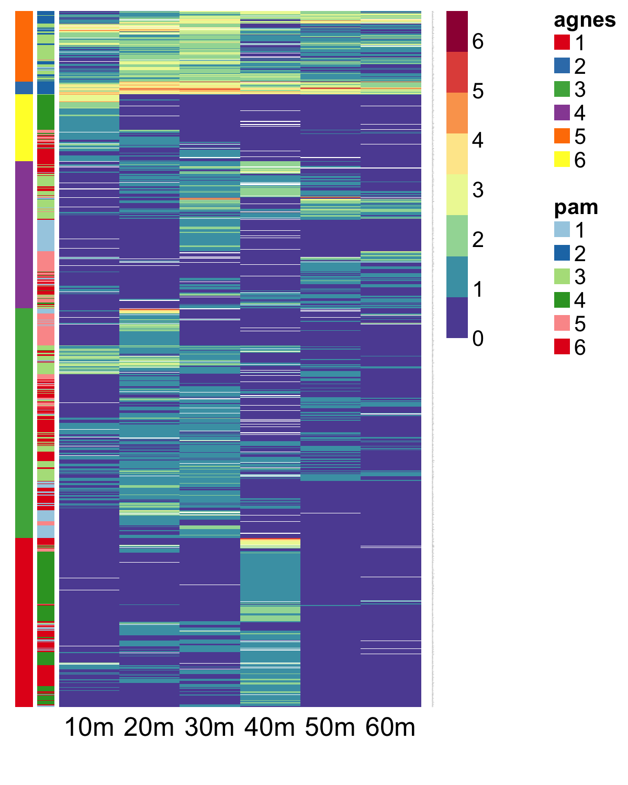
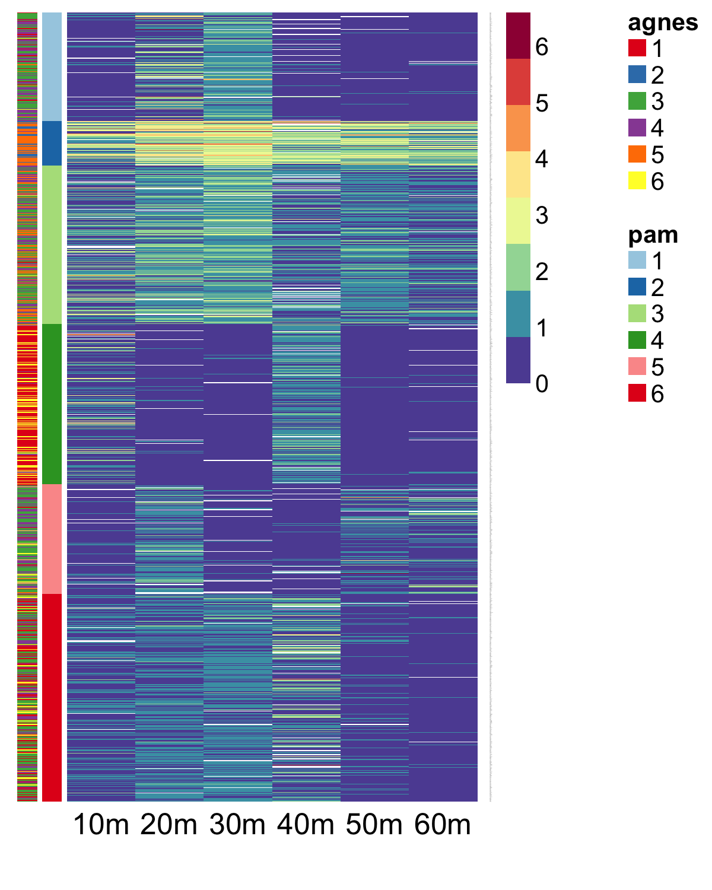

```{r}
require(tidyverse)
require(cowplot)
require(NMF)
```

## Goal

Compile a list of genes that respond to hydrogen peroxide stress in _S. cerevisiae_

## Data

### Gasch 2000 (PMID: 11102521)
The data file below was downloaded from the now defunct [website](http://www-genome.stanford.edu/yeast_stress) by Vivek. He didn't save the entire zip file, only the H2O2 treatment one. The log2 FC data can still be accessed through the GEO database under accession [GSE18](https://www.ncbi.nlm.nih.gov/geo/query/acc.cgi?acc=GSE18)

```{r}
dat <- read_tsv("../input/gasch-2000-h2o2-time-course-log2FC.txt") %>% 
  mutate(`40m` = gsub("###", NA, `40m`) %>% as.double()) # some values in the 40m column are "###"
mat <- select(dat, `10m`:`160m`) %>% as.matrix()
rownames(mat) <- dat$geneName
```

## Analysis
Identify OSR genes

### 0. Filter data
Filter out genes whose expression didn't change more than 2 fold at any timepoint. Specifically, we are only interested in induced genes here. So we will separately look at the up vs down regulated genes.

```{r}
gene.max <- apply(mat[,1:6], 1, function(x){
  if(length(na.omit(x)) == 0)
    return(NA)
  else
    return(max(na.omit(x)))
})
gene.max %>% na.omit() %>% ecdf() %>% plot(xlab = "log2FC")
abline(v = 1, lty = 2, col = "red")
```
About 20% of the genes are induced more than 2 fold at one or more time points during the first hour.

Additionally, remove genes with three or more NAs in the first 6 data points -- this poses some problem for the clustering downstream

```{r}
filter <- apply(mat[,1:6], 1, function(x) sum(!is.na(x)) >= 4)
mat1 <- mat[gene.max > 1 & !is.na(gene.max) & filter, 1:6]
```

We are mainly interested in gene induction. Therefore we will set all log2FC values lower than 0.5 to 0. This effectively combines all down-regulated and not strongly induced genes to a single group. In other words, the clustering only applies to gene induction and doesn't distinguish no-change from repressions. 
```{r}
mat2 <- ifelse(mat1 > 0.5, mat1, 0)
```

Use `agnes(method = "ward")` to perform clustering
```{r}
# hierarchical clustering
hc <- agnes(mat2, method = "ward")
# cut the tree to 5 clusters
hc.grp <- cutree(as.hclust(hc), h = 20)
# compare to PAM clustering
pam.grp <- pam(mat2, k = 6)$clustering
# visualize the clustering on the dendrogram
grp <- cbind("agnes" = hc.grp, "pam" = pam.grp)
pltree(hc, cex = 0.1, hang = -1)
dendextend::colored_bars(grp, dend = as.dendrogram(hc), add = TRUE, y_shift = -2.5)
df.grp <- data.frame(agnes = as.factor(hc.grp), pam = as.factor(pam.grp))
grp.col <- list(agnes = RColorBrewer::brewer.pal(6, name = "Set1"),
                pam = RColorBrewer::brewer.pal(6, name = "Paired"))
aheatmap(mat2, Colv = NA, Rowv = as.hclust(hc), color = "-Spectral:7", treeheight = 0, annRow = df.grp, annColors = grp.col,
         filename = "../output/20220320-gasch-2000-clustering-agnes.png", width = 4, height = 5)
aheatmap(mat2, Colv = NA, Rowv = order(pam.grp), color = "-Spectral:7", annRow = df.grp, annColors = grp.col,
         filename = "../output/20220320-gasch-2000-clustering-pam.png", width = 4, height = 5)
```

| AGNES | PAM |
|--|--|
|  |  |

_Discussion_

1. 40m sample had some odd properties. Many genes only showed strong induction at that time point alone. Those genes should not be included.
1. Clusters 2, 5 and 3 based on the hierarchical clustering algorithm are the most important.
1. PAM algorithm produces both shared and different cluster memberships. Clusters 2 and 3 are the most promising.

```{r}
dat1 <- df.grp %>% 
  rownames_to_column("geneName") %>% 
  left_join(dat)
```
```{r}
keywords <- c("oxidative|glutaredoxin|thioredoxin|peroxidase|glutathione")
dat2 <- dat1 %>% 
  filter(pam %in% c(2, 3)) %>% 
  mutate(keyword = grepl(keywords, `function`)) %>% 
  arrange(pam)
dat2 %>% 
  select(gene = geneName, agnes, pam, keyword, `10m`:`60m`, `function`)
```

Pull out gene lists for GO enrichment analysis
```{r}
dat2 %>% pull(geneID) %>% paste0(collapse = ",")
```

