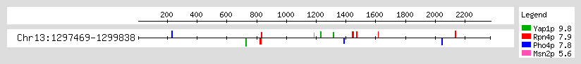

This is motivated by the discussion with Jinye on which factor contributes to _CgMSN4_'s upregulation during phosphate starvation. Pho4 and Pho2 does seem to bind to _CgMSN4_ promoter, but deleting Pho4 doesn't reduce its induction under phosphate starvation, arguing that either Pho4's binding is not responsible for _CgMSN4_ induction, or that other factors play redundant roles as Pho4. To identify potential TFs, I performed binding site prediction on both [Yeastract](http://www.yeastract.com/) and [Pathoyeastract](http://pathoyeastract.org/) using ~2.3 kb sequence upstream of _CgMSN4_ (before the next gene's CDS). The former contains all the documented PWM for _S. cerevisiae_ TFs, while the latter contains a much smaller dataset for just _C. glabrata_ TFs. Note that the collection of PWMs can be of different quality and from different experimental methods. That said, the result from the Yeastract identified a large number of TFs, including Msn2/4, Yap1, Xbp1, Pho2 etc. The latter has a smaller list of TFs, including Pdr1, Yap1, Msn2/4, Hap5 and Rpn4. I then specifically searched the sequence on using the matrix-scan tool on [RSAT](http://rsat-tagc.univ-mrs.fr/rsat/matrix-scan.cgi), choosing the PWMs for Pho4, Pho2, Yap1, Rpn4 and Msn4. The result is displayed below:

