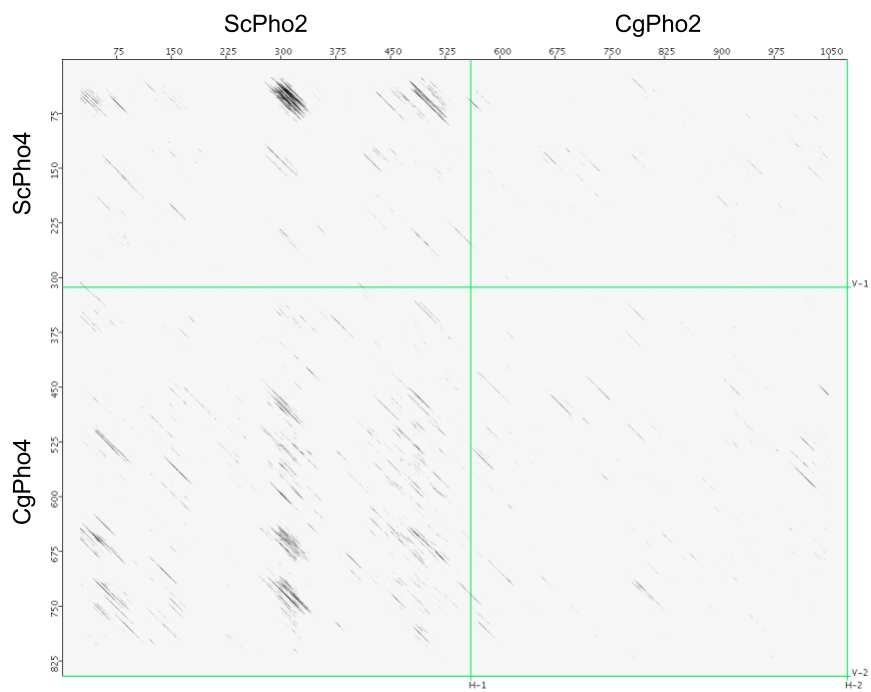
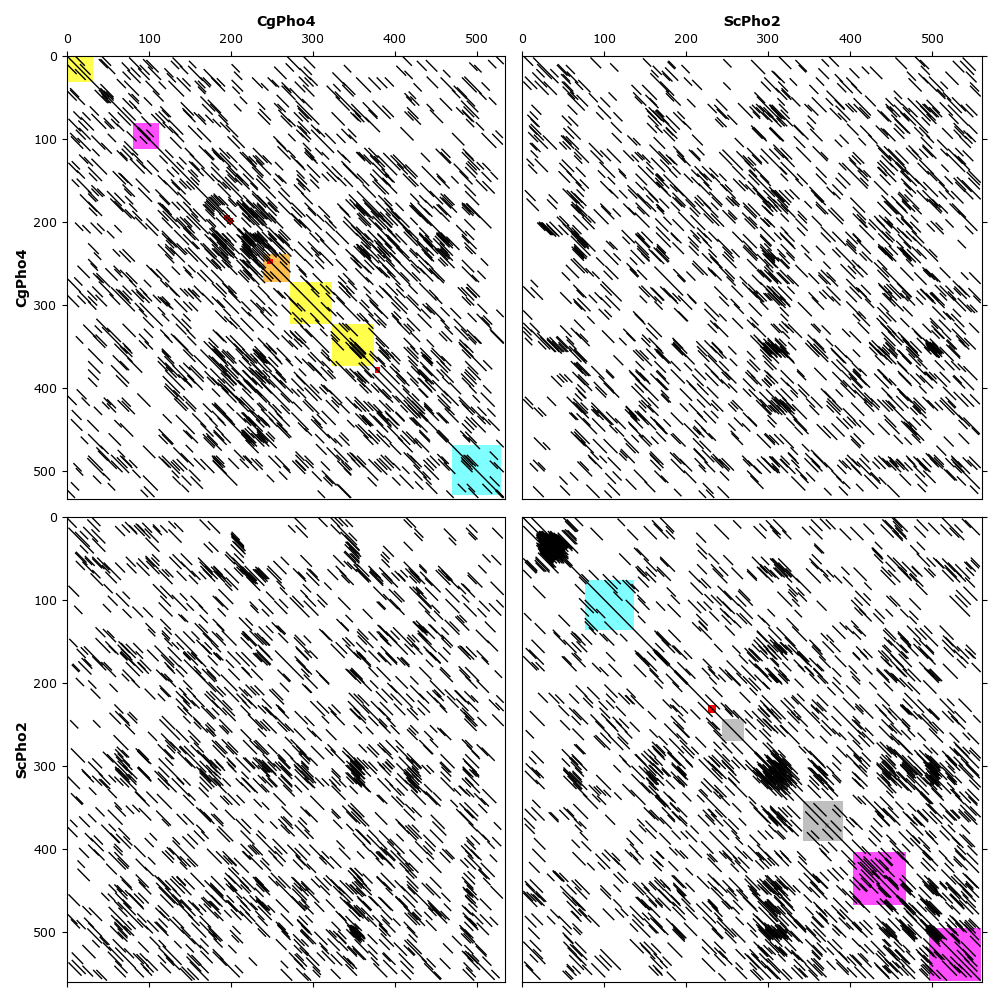

# Goal
- Question from Kyle:
    Did CgPho4's middle region resemble Pho2 sequences in any way? The rationale is that perhaps CgPho4 is a Pho4-Pho2 2-in-1, and that's why Pho2 is no longer needed.

# Approach
Use dot-plot to visualize similarities between CgPho4 (and ScPho4, for comparison) and ScPho2. To do so, I found a variety of dotplot algorithms, and settled on two of them, flexidot and dotter. Check the README file in the `script` folder for description of version and download info about the two programs.

# Methods
1. Gather CgPho4, ScPho4, ScPho2 sequences -- these are in the `data` folder.
1. Configure flexidot to perform the action.
    Because flexidot doesn't use a scoring matrix for protein sequences, meaning that it only scores match or mismatch, I tried different window sizes and threshold for substitutions, wrapped in a shell script under the `script` folder.
    One of the advantages of flexidot is that it allows feature annotation with General Feature Format (GFF). To put any detected similarity areas in the context of known protein domains, I copied the GFF file from the `Pho/Analysis/protein_evolution/Alignment/annotation` project folder and edited them to correct some mistakes in the CgPho4's annotation.
1. JDotter is a Java interface for the classical dotter program. The advantage of dotter is that it allows the user to dynamically change the thresholds -- the program scores the sequence pairs once using a scoring matrix, such as Blosom62, and then dynamically change the greyscale representation based on user's settings, like adjusting contrast.

# Results
1. JDotter results are in the form of a saved dotter session or an exported image.
     

    **Figure 1. JDotter output with contrast set to 0 (min) and 30 (max).** Note the vertical strip of diagonal streaks, which suggests similarities between ScPho4 / CgPho4 compared with ScPho2. The difference between ScPho4 and CgPho4 is that CgPho4 appears to have several regions matching the same region in ScPho2, while ScPho4 has just one region matching the same ScPho2 region, but which has a higher level of similarity (darker) than CgPho4's do.
1. Flexidot results are in the `output/CgPho4-ScPho2` or other similar folders, with log files tar balled into a single tgz file
    

    **Figure 2. Flexidot all-against-all plot for CgPho4 vs ScPho2.** Key parameters for dotter are: wordsize=10 (-k 10), # of substitutions allowed=7 (-S 7), plotting mode 2 (all-against-all). The colored blocks highlight annotated domains in ScPho2 and CgPho4: **yellow**, known protein-protein-interaction domains; **orange**, nuclear-localization sequence; **cyan**, DNA-binding domain; **magenta**, transactivation domain; **red**, phosphoserine known to modulate TF functions; **grey**, others. Note the same strip of similarities visible between CgPho4 and ScPho2. This region in ScPho2 appears to fall between two "CORE" domains.

# Conclusions
- The only interesting feature appears to be a ~50 a.a. region around amino acid position 300 in ScPho2, which matches, at low threshold (window size 10 and substitutions tolerance 7 for flexidot, or JDotter contrast set to 30 max) matches several regions in CgPho4. Given that the region in ScPho2 is not known to contact CgPho4, it is unclear what this similarity means.
